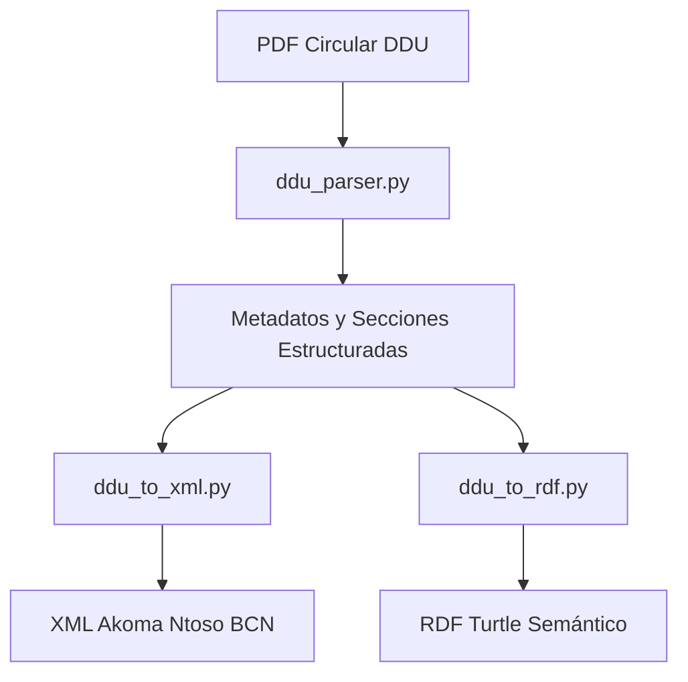

# Proyecto Biblioteca Normativa Circulares

Este repositorio implementa un sistema para el procesamiento, análisis y enriquecimiento semántico de **Circulares DDU** (División de Desarrollo Urbano del Ministerio de Vivienda y Urbanismo, Chile), transformándolas a formatos abiertos compatibles con la Biblioteca del Congreso Nacional (BCN).

---

## Organización del Repositorio

El proyecto se estructura en los siguientes directorios clave:

* [`bcn - consultas/`](file:///C:/Users/preusc/Documents/Proyecto%20Biblioteca%20Normativa%20Ciculares/bcn%20-%20consultas): Contiene los resultados de procesamiento semántico (.ttl, .xml) de las circulares de prueba.
* [`bcn - documentación/`](file:///C:/Users/preusc/Documents/Proyecto%20Biblioteca%20Normativa%20Ciculares/bcn%20-%20documentaci%C3%B3n): Contiene la documentación técnica oficial de la BCN, los esquemas de validación estructural (`Esquema Akoma-Ntoso BCN.xsd`, `Estructura Akoma Ntoso.xlsx`) y los CSVs del diccionario de datos y secuencia de plantilla.
* [`circulares/`](file:///C:/Users/preusc/Documents/Proyecto%20Biblioteca%20Normativa%20Ciculares/circulares): Colección de circulares DDU originales en formato PDF (por ejemplo, DDU 531, 533, 537 y 546).
* [`scripts/`](file:///C:/Users/preusc/Documents/Proyecto%20Biblioteca%20Normativa%20Ciculares/scripts): Módulos funcionales de procesamiento y conversión:
  * [`ddu_parser.py`](file:///C:/Users/preusc/Documents/Proyecto%20Biblioteca%20Normativa%20Ciculares/scripts/ddu_parser.py): Extracción de texto y metadatos de archivos PDF.
  * [`ddu_to_xml.py`](file:///C:/Users/preusc/Documents/Proyecto%20Biblioteca%20Normativa%20Ciculares/scripts/ddu_to_xml.py): Generador estructurado XML bajo el estándar Akoma Ntoso v2.0 BCN.
  * [`ddu_to_rdf.py`](file:///C:/Users/preusc/Documents/Proyecto%20Biblioteca%20Normativa%20Ciculares/scripts/ddu_to_rdf.py): Transformador a grafos semánticos RDF/Turtle.
  * [`leychile_api.py`](file:///C:/Users/preusc/Documents/Proyecto%20Biblioteca%20Normativa%20Ciculares/scripts/leychile_api.py) y helpers: Integración con la API de Ley Chile.
* [`test/`](file:///C:/Users/preusc/Documents/Proyecto%20Biblioteca%20Normativa%20Ciculares/test): Suite de pruebas automatizadas locales de integridad de datos, coberturas y generación estructural de XML y RDF.

---

## Arquitectura de Procesamiento



El flujo procesa el contenido textual del PDF, realiza un fallback estático para documentos escaneados históricos o con OCR corrupto, extrae de forma estructurada las referencias normativas a la OGUC/LGUC y produce salidas semánticas enlazables (Linked Open Data).

---

## Dependencias e Instalación

Este proyecto utiliza módulos estándar de Python 3 y requiere la siguiente dependencia externa:

* **pypdf**: Librería de extracción de texto y parseo de PDF.

Para verificar o instalar dependencias, ejecute:

```powershell
pip install pypdf
```

---

## Ejecución de la Suite de Pruebas

Para garantizar que el sistema y sus modelos semánticos de datos cumplen al 100% con los contratos estructurales definidos por el XSD y los CSV de la BCN, se incluye una suite completa de pruebas:

1. **Integridad de Columnas CSV**:

    ```powershell
    python test/test_csv_integrity.py
    ```

2. **Validación de Cobertura Estructural**:

    ```powershell
    python test/test_spec_coverage.py
    ```

3. **Certificación XSD vs CSV (Herencia y Atributos)**:

    ```powershell
    python test/test_xsd_structural_validation.py
    ```

4. **Verificación de Generación de XML Akoma Ntoso**:

    ```powershell
    python test/test_xml_generation.py
    ```

5. **Verificación de Generación RDF/Turtle**:

    ```powershell
    python test/test_rdf_generation.py
    ```
