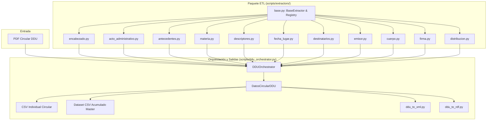

# Proyecto Biblioteca Normativa Circulares

Este repositorio implementa un sistema para el procesamiento, análisis y enriquecimiento semántico de **Circulares DDU** (División de Desarrollo Urbano del Ministerio de Vivienda y Urbanismo, Chile), transformándolas a formatos abiertos compatibles con la Biblioteca del Congreso Nacional (BCN).

---

## Organización del Repositorio

El proyecto se estructura en los siguientes directorios clave:

* [`bcn - consultas/`](file:///C:/Users/preusc/Documents/Proyecto%20Biblioteca%20Normativa%20Ciculares/bcn%20-%20consultas): Contiene los resultados de procesamiento semántico (.ttl, .xml) de las circulares de prueba.
* [`bcn - documentación/`](file:///C:/Users/preusc/Documents/Proyecto%20Biblioteca%20Normativa%20Ciculares/bcn%20-%20documentaci%C3%B3n): Contiene la documentación técnica oficial de la BCN, los esquemas de validación estructural (`Esquema Akoma-Ntoso BCN.xsd`), la especificación de cobertura local (`especificacion_cobertura.md`), el contrato de especificación estructural (`estructura_circular_ddu.csv`) y los CSVs del diccionario de datos y secuencia de plantilla.
* [`circulares/`](file:///C:/Users/preusc/Documents/Proyecto%20Biblioteca%20Normativa%20Ciculares/circulares): Colección de circulares DDU originales en formato PDF (por ejemplo, DDU 531, 533, 537 y 546).
* [`scripts/`](file:///C:/Users/preusc/Documents/Proyecto%20Biblioteca%20Normativa%20Ciculares/scripts): Módulos funcionales de procesamiento y conversión:
  * [`ddu_types.py`](file:///C:/Users/preusc/Documents/Proyecto%20Biblioteca%20Normativa%20Ciculares/scripts/ddu_types.py): Declaraciones de tipado estricto `DatosCircularDDU` y `SeccionDDU`.
  * [`extractors/`](file:///C:/Users/preusc/Documents/Proyecto%20Biblioteca%20Normativa%20Ciculares/scripts/extractors): Paquete de 11 ETLs modulares e independientes (`encabezado.py`, `acto_administrativo.py`, `antecedentes.py`, `materia.py`, `descriptores.py`, `fecha_lugar.py`, `destinatarios.py`, `emisor.py`, `cuerpo.py`, `firma.py`, `distribucion.py`) derivados de la interfaz base `BaseExtractor`.
  * [`ddu_orchestrator.py`](file:///C:/Users/preusc/Documents/Proyecto%20Biblioteca%20Normativa%20Ciculares/scripts/ddu_orchestrator.py): Orquestador central (`DDUOrchestrator`) que coordina los extractores registrados y exporta CSVs (individual por circular y dataset acumulado maestro).
  * [`ddu_parser.py`](file:///C:/Users/preusc/Documents/Proyecto%20Biblioteca%20Normativa%20Ciculares/scripts/ddu_parser.py): Wrapper de retrocompatibilidad apuntando al orquestador.
  * [`ddu_to_xml.py`](file:///C:/Users/preusc/Documents/Proyecto%20Biblioteca%20Normativa%20Ciculares/scripts/ddu_to_xml.py): Generador estructurado XML bajo el estándar Akoma Ntoso v2.0 BCN.
  * [`ddu_to_rdf.py`](file:///C:/Users/preusc/Documents/Proyecto%20Biblioteca%20Normativa%20Ciculares/scripts/ddu_to_rdf.py): Transformador a grafos semánticos RDF/Turtle.
  * [`leychile_api.py`](file:///C:/Users/preusc/Documents/Proyecto%20Biblioteca%20Normativa%20Ciculares/scripts/leychile_api.py): Integración oficial con la API de Ley Chile de la BCN.
* [`test/`](file:///C:/Users/preusc/Documents/Proyecto%20Biblioteca%20Normativa%20Ciculares/test): Suite plana de pruebas automatizadas locales (`test_extractor_base.py`, `test_extractor_metadata.py`, `test_extractor_body.py`, `test_orchestrator.py`, `test_csv_integrity.py`, `test_spec_coverage.py`, `test_xml_generation.py`, `test_rdf_generation.py`, `test_xsd_structural_validation.py`) ejecutables con `pytest`.

---

## Arquitectura de Procesamiento Modular (ETLs y Orquestador)


```mermaid
graph TD
    subgraph "Entrada"
        PDF[PDF Circular DDU]
    end

    subgraph "Paquete ETL (scripts/extractors/)"
        Base[base.py: BaseExtractor & Registry]
        Base --> Ext1[encabezado.py]
        Base --> Ext2[acto_administrativo.py]
        Base --> Ext3[antecedentes.py]
        Base --> Ext4[materia.py]
        Base --> Ext5[descriptores.py]
        Base --> Ext6[fecha_lugar.py]
        Base --> Ext7[destinatarios.py]
        Base --> Ext8[emisor.py]
        Base --> Ext9[cuerpo.py]
        Base --> Ext10[firma.py]
        Base --> Ext11[distribucion.py]
    end

    subgraph "Orquestación y Salidas (scripts/ddu_orchestrator.py)"
        PDF --> Orch[DDUOrchestrator]
        Ext1 & Ext2 & Ext3 & Ext4 & Ext5 & Ext6 & Ext7 & Ext8 & Ext9 & Ext10 & Ext11 --> Orch
        Orch --> Data[DatosCircularDDU]
        Data --> CSVInd[CSV Individual Circular]
        Data --> CSVMaster[Dataset CSV Acumulado Master]
        Data --> XML[ddu_to_xml.py]
        Data --> RDF[ddu_to_rdf.py]
    end
```

---

## Uso de los Módulos de Procesamiento

### 1. Ejecución de ETLs de Forma Independiente (CLI)

Cada módulo de extracción en `scripts/extractors/` puede ejecutarse de forma 100% aislada desde la consola:

```powershell
python -m scripts.extractors.antecedentes --pdf "circulares/DDU 533.pdf"
```

Imprimiendo en pantalla el objeto `ResultadoBloque` serializado en formato JSON.

### 2. Ejecución del Orquestador Central

Para procesar una circular completa y generar sus productos estructurados:

```powershell
python scripts/ddu_orchestrator.py --pdf "circulares/DDU 533.pdf" --export-csv
```

---

## Dependencias e Instalación

Este proyecto utiliza módulos estándar de Python 3 y requiere la siguiente dependencia externa:

* **pypdf**: Librería de extracción de texto y parseo de PDF.

Para verificar o instalar dependencias, ejecute:

```powershell
pip install pypdf
```

---

## Ejecución de la Suite de Pruebas

Para garantizar que el sistema y sus modelos semánticos de datos cumplen al 100% con los contratos estructurales definidos por el XSD, los CSV de la BCN y la suite de extractores, ejecute en la raíz del repositorio:

```powershell
pytest -v
```

Actualmente, **26 de 26 pruebas pasan exitosamente** (100% de cobertura de la suite en estructura plana).
