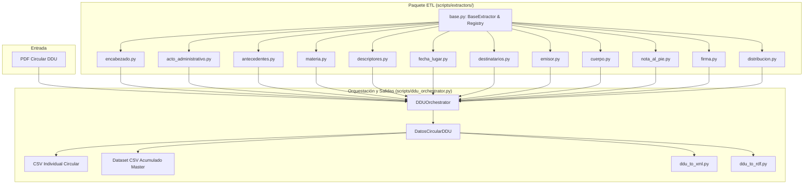

# Proyecto Biblioteca Normativa Circulares

Este repositorio implementa un sistema para el procesamiento, análisis y enriquecimiento semántico de **Circulares DDU** (División de Desarrollo Urbano del Ministerio de Vivienda y Urbanismo, Chile), transformándolas a formatos abiertos compatibles con la Biblioteca del Congreso Nacional (BCN).

---

## Organización del Repositorio

El proyecto se estructura en los siguientes directorios clave:

* [`bcn - consultas/`](file:///C:/Users/preusc/Documents/Proyecto%20Biblioteca%20Normativa%20Ciculares/bcn%20-%20consultas): Contiene los resultados de procesamiento semántico (.ttl, .xml) de las circulares de prueba.
* [`bcn - documentación/`](file:///C:/Users/preusc/Documents/Proyecto%20Biblioteca%20Normativa%20Ciculares/bcn%20-%20documentaci%C3%B3n): Contiene la documentación técnica oficial de la BCN, los esquemas de validación estructural (`Esquema Akoma-Ntoso BCN.xsd`), la especificación de cobertura local (`especificacion_cobertura.md`), el contrato de especificación estructural ([`estructura_circular_ddu.csv`](file:///C:/Users/preusc/Documents/Proyecto%20Biblioteca%20Normativa%20Ciculares/bcn%20-%20documentaci%C3%B3n/estructura_circular_ddu.csv)) y los CSVs del diccionario de datos y secuencia de plantilla.
* [`circulares/`](file:///C:/Users/preusc/Documents/Proyecto%20Biblioteca%20Normativa%20Ciculares/circulares): Colección de circulares DDU originales en formato PDF (por ejemplo, DDU 531, 533, 537 y 546).
* [`scripts/`](file:///C:/Users/preusc/Documents/Proyecto%20Biblioteca%20Normativa%20Ciculares/scripts): Módulos funcionales de procesamiento y conversión:
  * [`ddu_types.py`](file:///C:/Users/preusc/Documents/Proyecto%20Biblioteca%20Normativa%20Ciculares/scripts/ddu_types.py): Declaraciones de tipado estricto `DatosCircularDDU` y `SeccionDDU`.
  * [`extractors/`](file:///C:/Users/preusc/Documents/Proyecto%20Biblioteca%20Normativa%20Ciculares/scripts/extractors): Paquete de 12 ETLs modulares e independientes (`encabezado.py`, `acto_administrativo.py`, `antecedentes.py`, `materia.py`, `descriptores.py`, `fecha_lugar.py`, `destinatarios.py`, `emisor.py`, `cuerpo.py`, `nota_al_pie.py`, `firma.py`, `distribucion.py`) derivados de la interfaz base `BaseExtractor`.
  * [`ddu_orchestrator.py`](file:///C:/Users/preusc/Documents/Proyecto%20Biblioteca%20Normativa%20Ciculares/scripts/ddu_orchestrator.py): Orquestador central (`DDUOrchestrator`) que coordina los extractores registrados y exporta CSVs (individual por circular y dataset acumulado maestro).
  * [`ddu_parser.py`](file:///C:/Users/preusc/Documents/Proyecto%20Biblioteca%20Normativa%20Ciculares/scripts/ddu_parser.py): Wrapper de retrocompatibilidad apuntando al orquestador.
  * [`ddu_to_xml.py`](file:///C:/Users/preusc/Documents/Proyecto%20Biblioteca%20Normativa%20Ciculares/scripts/ddu_to_xml.py): Generador estructurado XML bajo el estándar Akoma Ntoso v2.0 BCN.
  * [`csv_to_akoma_xml.py`](file:///C:/Users/preusc/Documents/Proyecto%20Biblioteca%20Normativa%20Ciculares/scripts/csv_to_akoma_xml.py): Transformador independiente especializado que convierte archivos CSV de circulares a XML Akoma Ntoso v2.0 BCN.
  * [`ddu_to_rdf.py`](file:///C:/Users/preusc/Documents/Proyecto%20Biblioteca%20Normativa%20Ciculares/scripts/ddu_to_rdf.py): Transformador a grafos semánticos RDF/Turtle.
  * [`leychile_api.py`](file:///C:/Users/preusc/Documents/Proyecto%20Biblioteca%20Normativa%20Ciculares/scripts/leychile_api.py): Integración oficial con la API de Ley Chile de la BCN.
* [`test/`](file:///C:/Users/preusc/Documents/Proyecto%20Biblioteca%20Normativa%20Ciculares/test): Suite plana de pruebas automatizadas locales (`test_csv_to_akoma_xml.py`, `test_extractor_base.py`, `test_extractor_metadata.py`, `test_extractor_body.py`, `test_extractor_nota_al_pie.py`, `test_orchestrator.py`, `test_csv_integrity.py`, `test_spec_coverage.py`, `test_xml_generation.py`, `test_rdf_generation.py`, `test_xsd_structural_validation.py`) ejecutables con `pytest`.


---

## Modelo de Datos de Dominio y Extensibilidad Evolutiva

El proyecto adopta una **arquitectura en capas con separación clara de responsabilidades**:

1. **Capa de Dominio Plano e Intuitivo (CSV)**:
   Los datos extraídos se organizan bajo términos de dominio claros y legibles para analistas e ingenieros de datos (`numero_ddu`, `fecha_emision`, `cuerpo`, `firmante`, etc.) en formato CSV. Esto preserva la claridad humana y evita sobrecargar la extracción con nombres técnicos abstractos del estándar XML.
2. **Capa de Interoperabilidad Semántica (Akoma Ntoso XML & RDF)**:
   Los módulos [`scripts/ddu_to_xml.py`](file:///C:/Users/preusc/Documents/Proyecto%20Biblioteca%20Normativa%20Ciculares/scripts/ddu_to_xml.py) y [`scripts/ddu_to_rdf.py`](file:///C:/Users/preusc/Documents/Proyecto%20Biblioteca%20Normativa%20Ciculares/scripts/ddu_to_rdf.py) actúan como traductores que mapean automáticamente los campos de dominio a la taxonomía XML Akoma Ntoso v2.0 BCN (`FRBRWork`, `FRBRnumber`, `docDate`, `mainBody`, `authorialNote`) y a grafos semánticos RDF/Turtle.
3. **Extensibilidad Evolutiva del Pipeline ETL**:
   A medida que las circulares DDU evolucionen o incorporen nuevos bloques normativos en el futuro, es posible registrar nuevos extractores en [`scripts/extractors/`](file:///C:/Users/preusc/Documents/Proyecto%20Biblioteca%20Normativa%20Ciculares/scripts/extractors) mediante el decorador `@register_extractor`. El orquestador [`scripts/ddu_orchestrator.py`](file:///C:/Users/preusc/Documents/Proyecto%20Biblioteca%20Normativa%20Ciculares/scripts/ddu_orchestrator.py) incorporará las nuevas columnas al CSV sin alterar el código existente ni romper la generación Akoma Ntoso.

---

## Mapeo Estandarizado de la Estructura (CSV -> ETLs)

La suite de los 12 ETLs modulares deriva exactamente del contrato de especificación documentado en [`bcn - documentación/estructura_circular_ddu.csv`](file:///C:/Users/preusc/Documents/Proyecto%20Biblioteca%20Normativa%20Ciculares/bcn%20-%20documentaci%C3%B3n/estructura_circular_ddu.csv), simplificado a **6 columnas esenciales** (`orden`, `bloque`, `campo`, `obligatorio`, `descripcion`, `reglas`):

| Bloque CSV | Campo Parser | Módulo ETL (`scripts/extractors/`) | Descripción |
| :--- | :--- | :--- | :--- |
| **Encabezado** | `numero` | `encabezado.py` | Número identificador de la circular DDU |
| **Acto Administrativo** | `numero_ord` | `acto_administrativo.py` | Número de acto ordinario de emisión (ej. ORD. N° 112) |
| **Antecedentes** | `antecedentes` | `antecedentes.py` | Documentos o definiciones de origen (ANT:) |
| **Materia** | `materia` | `materia.py` | Descripción del tema o norma abordada (MAT:) |
| **Descriptores** | `descriptores` | `descriptores.py` | Vocablos y palabras clave de catalogación |
| **Fecha y Lugar** | `fecha_emision` | `fecha_lugar.py` | Fecha en formato ISO YYYY-MM-DD y ciudad |
| **Destinatarios** | `destinatarios` | `destinatarios.py` | Destinatario formal del oficio (A:) |
| **Emisión** | `emisor` | `emisor.py` | Cargo del emisor (DE:) |
| **Cuerpo** | `secciones` | `cuerpo.py` | Estructura de secciones romanas, numerales y listas |
| **Nota al Pie** | `notas_al_pie` | `nota_al_pie.py` | Notas aclaratorias o referencias normativas al pie de página |
| **Firma** | `firmante` | `firma.py` | Firma del Jefe de División |
| **Distribución** | `lista_distribucion` | `distribucion.py` | Nómina de receptores al cierre del documento |

---

## Arquitectura de Procesamiento Modular (ETLs y Orquestador)


```mermaid
graph TD
    subgraph "Entrada"
        PDF[PDF Circular DDU]
    end

    subgraph "Paquete ETL (scripts/extractors/)"
        Base[base.py: BaseExtractor & Registry]
        Base --> Ext1[encabezado.py]
        Base --> Ext2[acto_administrativo.py]
        Base --> Ext3[antecedentes.py]
        Base --> Ext4[materia.py]
        Base --> Ext5[descriptores.py]
        Base --> Ext6[fecha_lugar.py]
        Base --> Ext7[destinatarios.py]
        Base --> Ext8[emisor.py]
        Base --> Ext9[cuerpo.py]
        Base --> Ext10[nota_al_pie.py]
        Base --> Ext11[firma.py]
        Base --> Ext12[distribucion.py]
    end

    subgraph "Orquestación y Salidas (scripts/ddu_orchestrator.py)"
        PDF --> Orch[DDUOrchestrator]
        Ext1 & Ext2 & Ext3 & Ext4 & Ext5 & Ext6 & Ext7 & Ext8 & Ext9 & Ext10 & Ext11 & Ext12 --> Orch
        Orch --> Data[DatosCircularDDU]
        Data --> CSVInd[CSV Individual Circular]
        Data --> CSVMaster[Dataset CSV Acumulado Master]
        Data --> XML[ddu_to_xml.py]
        Data --> RDF[ddu_to_rdf.py]
    end
```

---

## Guía de Ejecución y Visualización de Resultados

### 1. Ejecución de ETLs de Forma Independiente (CLI)

Si deseas probar la extracción de **un bloque específico** sobre cualquier circular (ej. `DDU 531.pdf`):

```powershell
py -3 -m scripts.extractors.materia --pdf "circulares/DDU 531.pdf"
```

* **Salida / Visualización**: Imprime en consola un JSON estructurado (`ResultadoBloque`) con el resultado del bloque y su nivel de confianza.

### 2. Ejecución Orquestada Completa (Generación de CSV)

Para procesar todos los ETLs y exportar la ficha CSV de la circular:

```powershell
py -3 scripts/ddu_orchestrator.py --pdf "circulares/DDU 531.pdf" --export-csv
```

* **Salida / Visualización**: Genera un archivo CSV codificado en UTF-8 con BOM y delimitado por punto y coma (`;`) listo para MS Excel en la carpeta `salidas_csv/` (ej. [`salidas_csv/DDU_531_extraido.csv`](file:///C:/Users/preusc/Documents/Proyecto%20Biblioteca%20Normativa%20Ciculares/salidas_csv/DDU_531_extraido.csv)).

---

## Dependencias e Instalación

Este proyecto utiliza módulos estándar de Python 3 y requiere la siguiente dependencia externa:

* **pypdf**: Librería de extracción de texto y parseo de PDF.

Para verificar o instalar dependencias, ejecute:

```powershell
pip install pypdf
```

---

## Ejecución de la Suite de Pruebas

Para garantizar que el sistema y sus modelos semánticos de datos cumplen al 100% con los contratos estructurales definidos por el XSD, los CSV de la BCN y la suite de extractores, ejecute en la raíz del repositorio:

```powershell
pytest -v
```

Actualmente, **42 de 42 pruebas pasan exitosamente** (100% de cobertura de la suite en estructura plana).
