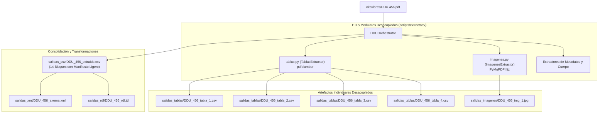

# Documento de Diseño: Arquitectura Desacoplada de Tablas e Imágenes con Manifiesto Ligero en CSV

**Fecha**: 2026-08-14  
**Estado**: Aprobado por el Usuario (Opción A)  
**Rama**: `feature/ddu-456`  
**Autor**: Antigravity (Superpowers Workflow)

---

## 1. Contexto y Justificación del Desacople

En la arquitectura de 14 bloques normativos de las circulares DDU, la inclusión directa de volcados JSON completos de tablas e imágenes en las celdas del archivo CSV principal (`salidas_csv/DDU_456_extraido.csv`) generaba celdas de texto masivas (>10 KB) con múltiples escapes, lo que reducía la legibilidad humana en hojas de cálculo y mezclaba el nivel semántico de metadatos con el almacenamiento de datos binarios o tabulares complejos.

La **Opción A (Arquitectura Desacoplada)** resuelve esta problemática mediante:
1. **Almacenamiento Desacoplado de Tablas (`salidas_tablas/`)**: Cada tabla detectada y extraída por `TablasExtractor` se exporta como un archivo CSV independiente estructurado (`DDU_{num}_tabla_{idx}.csv`).
2. **Almacenamiento Desacoplado de Imágenes (`salidas_imagenes/`)**: Cada imagen o diagrama técnico extraído por `ImagenesExtractor` se guarda como archivo de imagen nativo (`.png` / `.jpg`) en `salidas_imagenes/` (`DDU_{num}_img_{idx}.png`).
3. **Manifiesto Ligero e IDs Canónicos en CSV Principal**: En la fila `Tablas` e `Imágenes` del CSV individual, se almacena una lista JSON compacta (manifiesto de referencias) con identificadores canónicos unívocos, metadatos esenciales (página, dimensiones, filas, columnas) y la ruta relativa al archivo anexo.

---

## 2. Diagrama de Arquitectura y Flujo de Datos



---

## 3. Especificación de Manifiestos y Artefactos

### 3.1 Manifiesto de Tablas (`bloque="Tablas"`, `campo="tablas"`)

Estructura de cada ítem en el manifiesto ligero:
```json
[
  {
    "id": "DDU_456_tabla_1",
    "nombre": "Modificaciones Normativas (DDU 339, DDU 322)",
    "pagina": 5,
    "filas": 2,
    "columnas": 3,
    "archivo_anexo": "salidas_tablas/DDU_456_tabla_1.csv"
  },
  {
    "id": "DDU_456_tabla_2",
    "nombre": "Modificaciones Normativas (DDU 168 - Numerales a y b)",
    "pagina": 6,
    "filas": 2,
    "columnas": 3,
    "archivo_anexo": "salidas_tablas/DDU_456_tabla_2.csv"
  }
]
```

Estructura de los archivos anexos en `salidas_tablas/`:
* Archivos delimitados por punto y coma (`;`), codificación `utf-8-sig`, `csv.QUOTE_ALL`.
* Primera fila: Encabezados de columna extraídos.
* Filas subsiguientes: Celdas saneadas con corrección tipográfica OCR.

### 3.2 Manifiesto de Imágenes (`bloque="Imágenes"`, `campo="imagenes"`)

Estructura de cada ítem en el manifiesto ligero:
```json
[
  {
    "id": "DDU_456_img_1",
    "nombre": "Esquema ilustrativo: Planta azotea y corte esquemático",
    "pagina": 3,
    "ancho": 700,
    "alto": 760,
    "formato": "jpeg",
    "archivo_anexo": "salidas_imagenes/DDU_456_img_1.jpeg"
  }
]
```

Estructura de los archivos anexos en `salidas_imagenes/`:
* Extracción binaria nativa directa desde el PDF con `PyMuPDF` (`fitz`).
* Nombre normalizado `DDU_{num}_img_{idx}.{ext}`.

---

## 4. Requisitos de Calidad y Compatibilidad

1. **Tipado Estricto (Pylance Strict Mode)**:
   * Mantener todas las definiciones de tipos en `scripts/ddu_types.py` y los extractores sin errores de Pyright.
2. **Autonomía y Cero Fallos**:
   * Manejo automático de creación de carpetas `salidas_tablas/` y `salidas_imagenes/`.
   * Comportamiento robusto cuando no se detecten tablas o imágenes (manifiesto vacío `[]`).
3. **Suite de Pruebas**:
   * Actualización de `test/test_extractor_tablas.py`, `test/test_extractor_imagenes.py` y `test/test_orchestrator.py` para validar la existencia física de los archivos anexos y la corrección de los manifiestos ligeros.
   * 100% de cobertura y paso en `pytest -v`.
