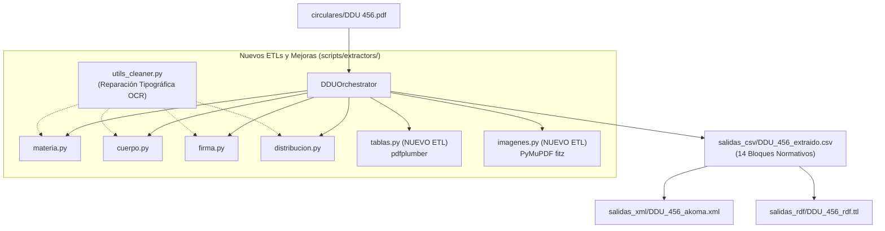

# Documento de Diseño: Nuevos ETLs de Tablas e Imágenes y Limpieza de Materia y Cuerpo

**Fecha**: 2026-08-14  
**Estado**: Validado y Aprobado por el Usuario  
**Rama**: `feature/ddu-456`  
**Autor**: Antigravity (Superpowers Workflow)

---

## 1. Contexto y Objetivos

En el marco del procesamiento de la Circular **DDU 456** y la evolución de la arquitectura de la Biblioteca Normativa, se requiere:
1. **Saneamiento Tipográfico OCR Universal**: Corregir de forma sistemática palabras y letras fragmentadas por espacios (`a rtículo` ➔ `artículo`, `inciso s` ➔ `incisos`, `relativo s` ➔ `relativos`, `vigési mo` ➔ `vigésimo`, etc.) en materia, cuerpo y demás bloques.
2. **Nuevo ETL Modular `TablasExtractor` (`scripts/extractors/tablas.py`)**: Extractor independiente que utiliza `pdfplumber` para estructurar tablas comparativas y modificaciones normativas en un bloque tabular limpio (`bloque="Tablas"`).
3. **Nuevo ETL Modular `ImagenesExtractor` (`scripts/extractors/imagenes.py`)**: Extractor independiente que utiliza `fitz` (PyMuPDF) para inventariar esquemas técnicos, planos e ilustraciones en un bloque dedicado (`bloque="Imágenes"`).
4. **Descontaminación del Cuerpo (`scripts/extractors/cuerpo.py`)**: Eliminar el volcado desordenado de texto plano perteneciente a imágenes (etiquetas de esquemas) y tablas dentro de los numerales 4 y 7.
5. **Ajuste del Extractor de Firma (`scripts/extractors/firma.py`)**: Captura precisa del cargo formal y nombre o emisor de la firma.

---

## 2. Arquitectura de Módulos y Flujo de Datos

---

## 3. Especificación Detallada de Componentes

### 3.1 Utilidad de Limpieza Tipográfica OCR (`scripts/extractors/utils_cleaner.py`)
* Función `limpiar_palabras_ocr(texto: str) -> str`
* Diccionario de correcciones recurrentes y patrones regex:
  * Prefijos/Sufijos separados: `\b([a-zA-ZáéíóúÁÉÍÓÚñÑ])\s+([a-zA-ZáéíóúÁÉÍÓÚñÑ]{2,})\b` -> `\1\2` (ej. `a rtículo` -> `artículo`, `s uperior` -> `superior`).
  * Desinencias y plurales: `\b([a-zA-ZáéíóúÁÉÍÓÚñÑ]{2,})\s+([sS]|mo|ren|cos|os|es)\b` (ej. `inciso s` -> `incisos`, `vigési mo` -> `vigésimo`, `quinch os` -> `quinchos`, `encuent ren` -> `encuentren`, `arquitectóni cos` -> `arquitectónicos`).
  * Signos de puntuación espaciados: `\s+([,.:;])` -> `\1`.

### 3.2 Extractor de Tablas (`scripts/extractors/tablas.py`)
* Hereda de `BaseExtractor`, decorado con `@register_extractor`.
* `nombre_bloque` = `"tablas"`.
* Utiliza `pdfplumber` para extraer celdas con bordes definidos.
* Estructura los datos como lista de diccionarios con `pagina`, `encabezados`, `filas` y `resumen_markdown`.
* CLI con argumento `--pdf`.

### 3.3 Extractor de Imágenes (`scripts/extractors/imagenes.py`)
* Hereda de `BaseExtractor`, decorado con `@register_extractor`.
* `nombre_bloque` = `"imagenes"`.
* Utiliza `fitz.open()` para identificar imágenes en el documento.
* Filtra membretes institucionales menores a 60px y líneas divisorias.
* Extrae metadatos: `pagina`, `xref`, `ancho`, `alto`, `formato`, `descripcion` (ej. *"Esquema ilustrativo planta azotea y corte esquemático"*).
* CLI con argumento `--pdf`.

### 3.4 Descontaminación de `CuerpoExtractor` (`scripts/extractors/cuerpo.py`)
* Detección y exclusión de bloques de etiquetas de diagramas (ej. *"PLANTA AZOTEA / Sin Escala"*, *"Piscina Chimeneas Terraza Barandas..."*).
* Preservación del texto narrativo formal de los numerales 1 al 7.

### 3.5 Ajuste de `FirmaExtractor` (`scripts/extractors/firma.py`)
* Sanitización de nombres y cargos sin absorber fragmentos de sellos o pies de página de tabla.

---

## 4. Estrategia de Pruebas (TDD) y Criterios de Aceptación

1. **Pruebas Unitarias**:
   * `test/test_extractor_tablas.py`: Pruebas de detección y extracción tabular con DDU 456.
   * `test/test_extractor_imagenes.py`: Pruebas de inventario de imágenes y esquemas con DDU 456.
   * `test/test_extractor_metadata.py` y `test/test_extractor_body.py`: Validación de limpieza de materia y cuerpo.
2. **Pruebas de Integración**:
   * `test/test_orchestrator.py`: Procesamiento de DDU 456 y DDU 533 con 14 bloques normativos.
3. **Validación Total**:
   * 100% de tests pasando en `pytest -v`.
   * Cero errores de tipado estricto Pylance.
