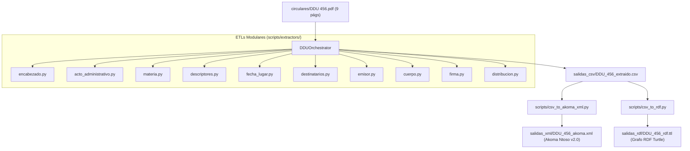

# Documento de Diseño: Procesamiento y Enriquecimiento Semántico de la Circular DDU 456

**Fecha**: 2026-08-14  
**Estado**: Validado y Aprobado  
**Rama**: `feature/ddu-456`  
**Autor**: Antigravity (Superpowers Workflow)

---

## 1. Contexto y Propósito

El objetivo de este diseño es establecer la arquitectura y especificación técnica para procesar la **Circular DDU 456** (`circulares/DDU 456.pdf`, 9 páginas, emitida el 25 de febrero de 2021) e integrarla de forma 100% dinámica al ecosistema del proyecto mediante tres representaciones semánticas estandarizadas:
1. **Capa de Dominio Tabular**: Archivo CSV plano de 12 bloques normativos (`salidas_csv/DDU_456_extraido.csv`).
2. **Capa de Interoperabilidad XML**: Documento Akoma Ntoso v2.0 BCN conforme al XSD oficial (`salidas_xml/DDU_456_akoma.xml`).
3. **Capa de Conocimiento en Grafo RDF**: Grafo semántico Turtle (`salidas_rdf/DDU_456_rdf.ttl`) con relaciones ontológicas hacia la normativa nacional y circulares históricas.

---

## 2. Requerimientos Estructurales de la DDU 456

### 2.1 Metadatos y Encabezado
* **Número Identificador**: `DDU 456`
* **Acto Administrativo**: `CIRCULAR ORD. N° 88`
* **Materia**: Aplicación del artículo 2.6.3. incisos vigésimo a vigésimo tercero de la OGUC sobre terrazas, elementos superiores de edificios y pisos mecánicos.
* **Descriptores / Vocablos**: `NORMAS URBANISTICAS ; ALTURA MÁXIMA DE EDIFICACIÓN, ELEMENTOS EXTERIORES UBICADOS EN LA PARTE SUPERIOR DE LOS EDIFICIOS, PISOS MECÁNICOS.` (sin prefijo explícito, en mayúsculas sostenidas).
* **Fecha y Lugar**: `Santiago, 2021-02-25`
* **Emisor / Firmante**: `JEFE DIVISIÓN DE DESARROLLO URBANO`
* **Destinatarios / Distribución**: `SEGÚN DISTRIBUCIÓN` con 34 receptores institucionales.

### 2.2 Cuerpo Normativo y Precedencia Legal
* **Numerales 1 al 6**: Interpretación reglamentaria del Decreto Supremo N° 58 (V. y U.) de 2019, incluyendo incisos `a)`, `b)`, `c)`, `d)`, `e)` y esquema gráfico en el numeral 4.
* **Numeral 7 (Modificaciones y Derogaciones)**:
  * Modifica formalmente las circulares: **DDU 183**, **DDU 248**, **DDU 322** y **DDU 168**.
  * Declara expresamente **dejar sin efecto** la **DDU 339**.

---

## 3. Arquitectura y Flujo de Datos

---

## 4. Decisiones de Diseño y Refinamiento de Módulos

1. **Extractor de Firma (`scripts/extractors/firma.py`)**:
   * *Problema*: La tabla de modificaciones del Numeral 7 en la página 8 finaliza con la cabecera `Motivo y/o Consideraciones`, provocando que el extractor capturase erróneamente la palabra `Consideraciones`.
   * *Solución de Diseño*: Crear una lista de exclusión de cabeceras tabulares (`palabras_descarte`) y ampliar la ventana de búsqueda tras `Saluda atentamente` hasta 15 líneas para capturar directamente el cargo formal `Jefe DIVISIÓN de Desarrollo Urbano`.

2. **Extractor de Descriptores y Materia (`scripts/extractors/descriptores.py`, `scripts/extractors/materia.py`)**:
   * *Problema*: La DDU 456 no tiene la etiqueta `DESC.:`, sino que ubica los descriptores en mayúsculas directamente bajo la materia. Además, un salto de línea con la palabra `circular` en el cuerpo provocaba un adelanto excesivo del puntero de escaneo.
   * *Solución de Diseño*: Limitar el escaneo de cabecera a 15 líneas e incluir en `_es_inicio_descriptores` palabras clave como `NORMAS URBANISTICAS` y delimitadores `;` para separar limpiamente materia y descriptores.

3. **Formateo de Número en XML Akoma Ntoso (`scripts/ddu_to_xml.py`)**:
   * *Problema*: Duplicación del prefijo (`DDU DDU 456`) al renderizar `<docNumber>`.
   * *Solución de Diseño*: Normalización mediante regex `re.sub(r"^DDU\s*", "", numero)`.

---

## 5. Estrategia de Pruebas y Criterios de Éxito

* **Metodología TDD**: Casos de prueba unitarios en `test/test_extractor_metadata.py` y `test/test_extractor_body.py`.
* **Cobertura y Calidad**: 100% de pruebas exitosas en `pytest -v` (48/48 tests).
* **Tipado Estricto**: Cero errores de diagnóstico en Pylance / Strict Mode.
