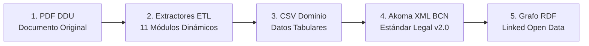

# Guión y Contenido Ejecutivo para Presentación PowerPoint (PPT)

**Proyecto:** Biblioteca Normativa Circulares DDU  
**Módulo:** Estructuración Semántica (Akoma Ntoso XML BCN & Grafos RDF)  
**Objetivo:** Presentación Ejecutiva / Directiva sobre el Valor Institucional y la Solución a la Calidad de Respuestas RAG para las DOM

---

## 📱 Diapositiva 1: Portada

* **Título Principal**: Proyecto Biblioteca Normativa Circulares DDU
* **Subtítulo**: Estructuración Semántica (Akoma Ntoso XML & Grafos RDF) para la Potenciación del Agente AI Legal de las Direcciones de Obras Municipales (DOM)
* **Elementos Visuales**:
  * Logo / Identidad Institucional MINVU.
  * Diagrama conceptual minimalista mostrando un documento PDF transformándose en una red de nodos semánticos interconectados.

> 🎤 **Notas para el Orador**:  
> *"Buenas tardes. Hoy presentamos el desarrollo técnico del módulo de estructuración semántica de Circulares DDU. El propósito central de este esfuerzo es transformar documentos normativos planos en datos estructurados de alta calidad para alimentar el aplicativo 'Biblioteca Normativa' y su Agente AI especializado en la legislación de construcción y urbanismo."*

---

## 🏛️ Diapositiva 2: El Desafío Institucional y el Agente "Biblioteca Normativa" (DOM)

* **Título**: El Desafío: Calidad de Respuestas en el Agente AI para las DOM
* **Subtítulo**: De la Ingesta Tradicional RAG a la Estructuración Semántica
* **Disposición Visual (Esquema Comparativo Antes vs. Con la Solución)**:

| Dimensión | Antes (Documentos No Estructurados con RAG) | Con la Solución (Akoma Ntoso + Grafo RDF) |
| :--- | :--- | :--- |
| **Ingesta de Datos** | PDFs planos procesados en bloques de texto arbitrarios. | Estructura atómica jerárquica y grafo de relaciones. |
| **Calidad de Respuesta** | **Baja precisión** y riesgo de fragmentación de contexto. | **Respuestas exactas** con cita legal por párrafo. |
| **Fundamentación** | Dificultad para precisar numerales y notas explicativas. | Identificación precisa de numerales, secciones y artículos. |

* **Punto Clave**: El aplicativo "Biblioteca Normativa" opera con arquitectura RAG, pero la ingesta de PDFs planos generaba respuestas de baja calidad. La incorporación del estándar Akoma Ntoso XML y su Grafo RDF provee una estructura clara y relaciones definidas para elevar radicalmente la precisión del Agente.

> 🎤 **Notas para el Orador**:  
> *"El sistema del proyecto Biblioteca Normativa opera sobre una arquitectura RAG. Sin embargo, habíamos identificado que la calidad general de las respuestas entregadas a los consultores y DOMs no era la óptima. Al procesar PDFs planos, el RAG perdía la jerarquía jurídica. Al incorporar el formato Akoma Ntoso y el grafo semántico, entregamos al Agente una estructura cristalina que elimina la ambigüedad y garantiza citas normativas exactas por párrafo."*

---

## 🔄 Diapositiva 3: Arquitectura de Procesamiento y Flujo General End-to-End

* **Título**: Flujo de Procesamiento End-to-End
* **Subtítulo**: Tubería de Transformación Dinámica de PDFs a Datos Enlazados
* **Concepto Visual (Diagrama de Proceso Horizontal de 5 Pasos)**:



* **Puntos Clave del Flujo**:
  1. **PDF DDU**: Documento fuente publicado por la División de Desarrollo Urbano.
  2. **Extractores ETL Modulares**: 11 scripts especializados que extraen dinámicamente cada bloque sin hardcodear metadatos estáticos.
  3. **CSV Dominio**: Capa intermedia plana que resguarda la información y permite la evolución tabular del dominio.
  4. **Akoma Ntoso XML BCN**: Conversión al estándar oficial de la Biblioteca del Congreso Nacional con jerarquía atómica de secciones y párrafos.
  5. **Grafo RDF (Turtle)**: Publicación en formato de datos abiertos enlazados para consulta ontológica.

> 🎤 **Notas para el Orador**:  
> *"En esta lámina observamos el recorrido completo que realiza la información en un flujo sencillo y automatizado: partimos del PDF original, aplicamos 11 extractores modulares dinámicos que no dependen de datos hardcodeados, ordenamos los datos en un formato CSV de dominio, y desde allí generamos tanto el estándar XML Akoma Ntoso BCN como el grafo semántico en RDF."*

---

## 💡 Diapositiva 4: El Valor de la Estructuración Semántica (Akoma Ntoso + RDF)

* **Título**: Dos Pilares Estratégicos de Valor
* **Subtítulo**: Capacidades Habilitantes para el Agente AI Legal
* **Disposición Visual (Tarjetas de Pilares Lado a Lado)**:

### 📐 Pilar 1: Estructura Jurídica Estándar (Akoma Ntoso BCN)
* Permite al Agente citar numerales, párrafos, notas al pie y descriptores exactos.
* Garantiza interoperabilidad con el estándar de la Biblioteca del Congreso Nacional (BCN v2.0).
* Asigna identificadores únicos irrepetibles por párrafo (`xs:ID`).

### 🕸️ Pilar 2: Red de Conocimiento Legal (Grafo RDF)
* Permite al Agente navegar las relaciones entre circulares.
* Vincula semánticamente las directrices con circulares previas (`minvu-ddu:complementaA`) y normas superiores (`minvu-ddu:interpretaA`).

> 🎤 **Notas para el Orador**:  
> *"La estructuración aporta dos pilares clave: primero, Akoma Ntoso entrega una anatomía atómica para que el Agente cite numerales y notas específicas; segundo, el grafo RDF conecta las circulares entre sí, permitiendo que el Agente entienda qué circular modifica o complementa a otra de forma autónoma."*

---

## 🚀 Diapositiva 5: Próximos Pasos e Hoja de Ruta de Integración

* **Título**: Hoja de Ruta de Integración y Evaluación
* **Subtítulo**: Plan de Trabajo Inmediato y Validación de Impacto en Negocio
* **Concepto Visual (Roadmap de 2 Fases)**:

```
[FASE 1: Integración Inicial y Pruebas de Rendimiento]
 └── Acoplamiento de la estructura (Akoma Ntoso + RDF) al aplicativo "Biblioteca Normativa" como baseline.
 └── Ejecución de pruebas de rendimiento por el equipo interno de negocio sobre las circulares procesadas.

[FASE 2: Escalamiento y Complejidad Structural]
 └── Ingesta y profundización de la extracción en nuevas circulares DDU con variaciones estructurales complejas.
 └── Consolidación del dataset maestro y evaluación continua de la calidad de respuesta.
```

* **Detalle de Ejecución**:
  * **Fase 1 (Acoplamiento & Baseline)**: El equipo técnico conecta los artefactos XML y RDF al proyecto "Biblioteca Normativa" para probar como punto de partida ("un desde") con lo construido. El equipo de negocio evalúa inmediatamente el comportamiento de las respuestas del RAG.
  * **Fase 2 (Escalamiento y Complejidad)**: Escalamiento del motor de extracción para procesar la totalidad del universo de circulares DDU con estructuras heterogéneas.

> 🎤 **Notas para el Orador**:  
> *"Nuestros próximos pasos están definidos en dos fases claras: en la Fase 1, el equipo técnico acopla de inmediato la estructura Akoma y RDF generada al aplicativo Biblioteca Normativa como punto de partida baseline, y el equipo de negocio evalúa el rendimiento en las respuestas. En la Fase 2, escalamos la ingesta hacia el resto del catálogo de circulares DDU abarcando variaciones estructurales avanzadas."*
