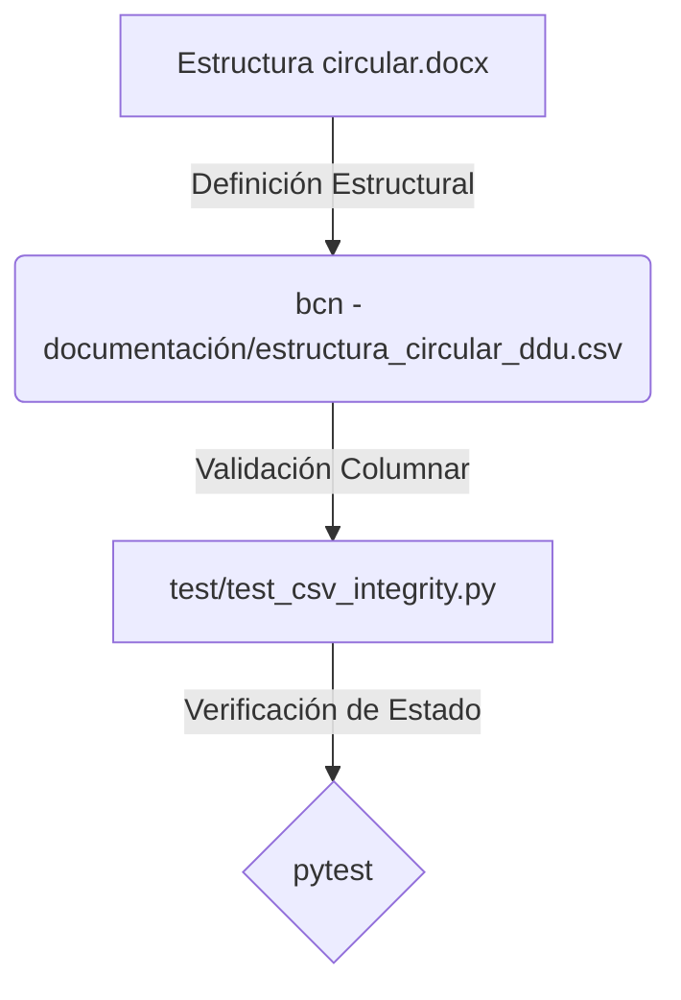

# Plan de Implementación: Estructura Circular DDU a CSV

> **For agentic workers:** REQUIRED SUB-SKILL: Use superpowers:subagent-driven-development to implement this plan task-by-task. Steps use checkbox (`- [ ]`) syntax for tracking.

**Goal:** Crear un archivo CSV que represente la definición de la estructura típica de una circular DDU con sus reglas, y validar su integridad con la suite de pruebas.

**Architecture:** Se creará un archivo CSV estático en el directorio de documentación de BCN. Luego, se extenderán los tests de integridad de CSV para incluir este nuevo archivo y validar que sus columnas y formatos cumplan con las reglas de negocio.

**Architecture Diagram:**



**Tech Stack:** Python 3, Pytest, CSV.

## Global Constraints
- **Exclusión de archivos**: El archivo CSV a crear es una definición estructural en texto plano y no datos masivos de producción, pero como política de GEMINI.md se mantiene local. No obstante, al ser parte de la especificación técnica que describe el Word, este CSV particular (`estructura_circular_ddu.csv`) debe quedar en el repositorio.
- **Idioma**: Todos los mensajes de commit y logs deben redactarse exclusivamente en español.
- **Estilo de Código**: Tipado estricto en cualquier función helper del test.

---

### Task 1: Creación del archivo CSV de estructura

**Files:**
- Create: `bcn - documentación/estructura_circular_ddu.csv`

**Interfaces:**
- Produces: `bcn - documentación/estructura_circular_ddu.csv` con las 12 columnas definidas en la especificación.

- [ ] **Step 1: Crear el archivo CSV**
  Escribir el archivo `bcn - documentación/estructura_circular_ddu.csv` con el siguiente contenido codificado en UTF-8:
  ```csv
  bloque,campo,tipo_dato,obligatorio,patron_regex,orden,zona,campo_parser,estado_parser,reglas,descripcion,ejemplo
  Encabezado,numero_ddu,metadato,si,DDU\s*(\d+),1,encabezado,numero,implementado,Secuencial y permite singularizar la circular,Número identificador de la circular DDU,DDU 364
  Acto Administrativo,numero_ord,metadato,si,ORD\.?\s*N[°o]?\s*(\d+),2,encabezado,,pendiente,Número de acto administrativo diferente al número DDU,Número del acto de emisión de la DDU,CIRCULAR ORD. N° 233
  Materia,materia,metadato,si,^MAT(ERIA)?\.?\s*:?\s*(.+)$,3,encabezado,materia,implementado,,Descripción del tema abordado,Modificación de proyecto...
  Descriptores,descriptores,metadato,no,,4,encabezado,,no_relevante,No relevante para la aplicación de la circular,Expresiones y vocablos asignados,
  Fecha y Lugar,fecha_emision,metadato,si,Santiago.*(\d{1,2})\s+(de\s+)?\w+\.?\s+(de\s+)?\d{2,4},5,encabezado,fecha,implementado,Permite singularizar junto con el número DDU,Fecha de emisión de la circular,Santiago, 23 Oct. 2007
  Emisión,emisor,metadato,si,^DE\s*:\s*(.+)$,6,encabezado,emisor,implementado,,Identifica al emisor de la circular DDU,JEFE DIVISION DE DESARROLLO URBANO
  Destinatarios,destinatarios,metadato,si,^A\s*:\s*(.+)$,7,encabezado,,pendiente,,A quién va dirigida formalmente la circular,SEREMIS
  Antecedentes,antecedentes,metadato,no,^ANT(ECEDENTES)?\.?\s*:?\s*(.+)$,8,encabezado,antecedentes,implementado,Campo implícito del oficio chileno,Documentación o normativa de antecedentes,Art. 4° LGUC
  Cuerpo,seccion_romana,estructura,no,^([IVXLCDM]+)\.\s+(.+)$,9,cuerpo,secciones,implementado,,Sección principal numerada con romano,I. ANTECEDENTES
  Cuerpo,numeral_arabigo,estructura,si,^(\d+)\.\s+(.+)$,10,cuerpo,secciones,implementado,Primer punto es resumen del contenido,Numeral o punto del cuerpo de la circular,1. Se informa que...
  Cuerpo,lista_multinivel,estructura,no,,11,cuerpo,,pendiente,Listas anidadas de números o letras,Listas multinivel del cuerpo,letra c) del punto 2
  Cuerpo,referencia_cruzada,referencia,no,Circular\s+DDU\s+(\d+),12,cuerpo,,pendiente,Indica numerales de otras circulares modificadas,Referencias a otras circulares,numeral 8 de la DDU 525
  Cuerpo,tabla_imagen,contenido,no,,13,cuerpo,,pendiente,Tablas e imágenes embebidas en secciones,Elementos visuales del cuerpo,numeral 2.2 de DDU 455
  Firma,firmante,metadato,si,,14,cierre,,pendiente,Jefe de división del periodo de emisión,Firma del jefe de división respectivo,
  Distribución,lista_distribucion,metadato,si,,15,cierre,,pendiente,,Lista de personas que reciben copia de la circular,Sr. Ministro de Vivienda...
  ```

- [ ] **Step 2: Verificar la creación**
  Comprobar que el archivo se ha creado correctamente y no tiene caracteres extraños.

- [ ] **Step 3: Commit**
  ```bash
  git add "bcn - documentación/estructura_circular_ddu.csv"
  git commit -m "feat: crear CSV de especificación de estructura circular DDU"
  ```

---

### Task 2: Actualización de la Suite de Pruebas de Integridad

**Files:**
- Modify: `test/test_csv_integrity.py`

**Interfaces:**
- Consumes: `bcn - documentación/estructura_circular_ddu.csv`
- Produces: Test automatizado verificado en pytest.

- [ ] **Step 1: Modificar el test de integridad**
  Asegurar que el test `test_csv_integrity.py` cargue y valide el nuevo archivo `estructura_circular_ddu.csv`. El test debe verificar:
  1. Que el archivo exista.
  2. Que contenga la cabecera correcta: `bloque,campo,tipo_dato,obligatorio,patron_regex,orden,zona,campo_parser,estado_parser,reglas,descripcion,ejemplo`.
  3. Que no tenga campos vacíos en columnas obligatorias como `bloque`, `campo`, `tipo_dato`, `obligatorio`, `orden` y `zona`.

  Aplicar los siguientes cambios en `test/test_csv_integrity.py`:
  ```diff
   # 1. Asegurar la integridad del nuevo CSV
   # ...
  ```

- [ ] **Step 2: Escribir la validación del CSV en `test/test_csv_integrity.py`**
  Modificar el código de `test/test_csv_integrity.py` para incluir la validación de `estructura_circular_ddu.csv`.

- [ ] **Step 3: Ejecutar los tests para verificar que fallen ante un CSV corrupto**
  Modificar temporalmente una cabecera de `estructura_circular_ddu.csv` (ej. cambiar `bloque` por `bloq`) y verificar que `pytest test/test_csv_integrity.py` falle.

- [ ] **Step 4: Restaurar el CSV y verificar que todos los tests pasen**
  Correr: `pytest -v`
  Esperado: 5 passed.

- [ ] **Step 5: Commit y Push**
  ```bash
  git add test/test_csv_integrity.py
  git commit -m "test: actualizar test de integridad para incluir el CSV de estructura circular"
  git push
  ```
