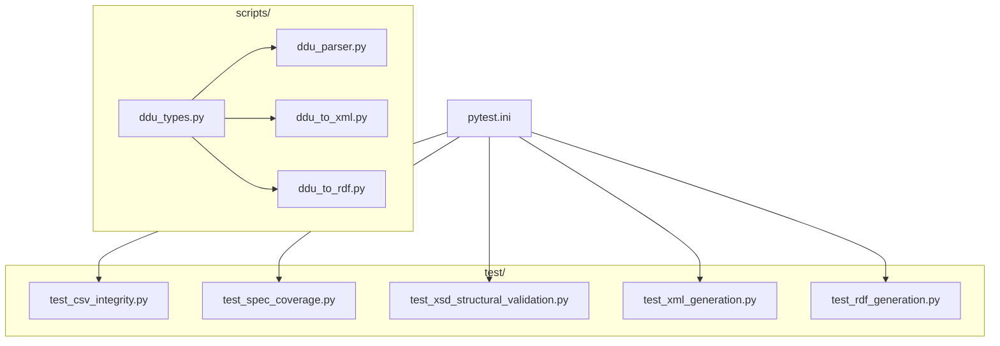

# Plan de Implementación de Refactorización y Calidad de Código

> **For agentic workers:** REQUIRED SUB-SKILL: Use superpowers:subagent-driven-development to implement this plan task-by-task. Steps use checkbox (`- [ ]`) syntax for tracking.

**Goal:** Implementar tipado estricto (strict typing), integrar la suite de pruebas locales con pytest de forma compatible con la ejecución manual de scripts, y configurar una validación de especificación local de cobertura Akoma Ntoso.

**Architecture:**
El parser de PDFs emitirá un diccionario tipado y estricto (`DatosCircularDDU`) a través de sus firmas. Los módulos constructores XML y RDF consumirán este tipo estructurado de forma nativa para evitar aserciones manuales o errores en tiempo de ejecución. La suite de pruebas locales será descubierta de forma nativa por pytest utilizando el archivo `pytest.ini` en la raíz del repositorio, preservando la compatibilidad de ejecución aislada `python test/*.py`.

**Architecture Diagram:**



**Tech Stack:** Python 3, pytest, pypdf.

## Global Constraints
*   **Anotaciones estrictas de tipado**: Mypy strict compatible en scripts y tests.
*   **Idioma obligatorio**: Todo commit e interacción debe ser redactado exclusivamente en español.
*   **Ignorado total de datos**: Ningún archivo `.xlsx`, `.xls`, `.pdf` o `.csv` debe formar parte de los commits de Git.

---

## Detalle de Tareas

### Tarea 1: Configurar Pytest e Importaciones

**Files:**
*   Create: `pytest.ini`
*   Modify: `test/test_csv_integrity.py:1-73`
*   Modify: `test/test_xsd_structural_validation.py:1-267`

**Interfaces:**
*   Consumes: Ninguna.
*   Produces: Configuración unificada de importaciones de pytest.

- [ ] **Paso 1: Crear archivo `pytest.ini`**
  Escribir el archivo `pytest.ini` en la raíz del repositorio para agregar el path de scripts a la búsqueda de módulos de pytest.
  
  ```ini
  [pytest]
  pythonpath = scripts
  testpaths = test
  python_files = test_*.py
  python_functions = test_*
  ```

- [ ] **Paso 2: Modificar `test/test_csv_integrity.py`**
  Renombrar `main()` a `test_csv_integrity()` y agregar el bloque de ejecución dual para python y pytest.
  
  ```python
  def test_csv_integrity() -> None:
      proyecto_raiz = Path(__file__).resolve().parents[1]
      
      doc_dir = proyecto_raiz / "bcn - documentación"
      if not doc_dir.exists():
          doc_dir = proyecto_raiz / "bcn - documentacion"
          
      csv_diccionario = doc_dir / "diccionario_dato_akoma_ntoso.csv"
      csv_secuencia = doc_dir / "secuencia_planilla_akoma_ntoso.csv"
      
      success_dicc = validar_csv(csv_diccionario, 6)
      success_sec = validar_csv(csv_secuencia, 6)
      
      assert success_dicc, "Fallo en integridad del CSV diccionario de datos"
      assert success_sec, "Fallo en integridad del CSV secuencia de planilla"

  if __name__ == "__main__":
      test_csv_integrity()
  ```

- [ ] **Paso 3: Modificar `test/test_xsd_structural_validation.py`**
  Renombrar `main()` a `test_xsd_structural_validation()` y adecuar aserciones y bloque de ejecución dual.
  
  ```python
  def test_xsd_structural_validation() -> None:
      # Lógica de carga e inicialización...
      assert discrepancias_tipo == 0, f"Existen {discrepancias_tipo} discrepancias de tipo entre XSD y CSV."
      assert discrepancias_attrs == 0, f"Existen {discrepancias_attrs} discrepancias de atributos entre XSD y CSV."

  if __name__ == "__main__":
      test_xsd_structural_validation()
  ```

- [ ] **Paso 4: Correr las primeras pruebas con pytest**
  Correr: `pytest test/test_csv_integrity.py test/test_xsd_structural_validation.py -v`
  Expected: PASS

- [ ] **Paso 5: Commit**
  ```bash
  git add pytest.ini test/test_csv_integrity.py test/test_xsd_structural_validation.py
  git commit -m "test: configurar pytest e integrar tests de integridad de csv y xsd"
  ```

---

### Tarea 2: Tipado Estricto en Parser y Transformador XML

**Files:**
*   Modify: `scripts/ddu_parser.py`
*   Modify: `scripts/ddu_to_xml.py`
*   Modify: `test/test_xml_generation.py`

**Interfaces:**
*   Consumes: `ddu_types.DatosCircularDDU`, `ddu_types.SeccionDDU`
*   Produces: Firmas de método tipadas de forma estricta.

- [ ] **Paso 1: Modificar `scripts/ddu_to_xml.py`**
  Importar `DatosCircularDDU` y `SeccionDDU`. Reemplazar la firma de `generar_xml` para recibir tipado estricto.
  
  ```python
  from ddu_types import DatosCircularDDU, SeccionDDU

  class DDUToXML:
      def generar_xml(self, datos: DatosCircularDDU) -> str:
          # Lógica interna utilizando datos con tipado estricto...
  ```

- [ ] **Paso 2: Modificar `test/test_xml_generation.py`**
  Renombrar `main()` a `test_xml_generation()` y adaptar aserciones y bloque de ejecución dual.
  
  ```python
  def test_xml_generation() -> None:
      # Lógica de test de xml...
      assert xml_str, "El XML generado está vacío."
      # Validaciones y asserts adicionales...

  if __name__ == "__main__":
      test_xml_generation()
  ```

- [ ] **Paso 3: Correr test de generación XML**
  Correr: `pytest test/test_xml_generation.py -v`
  Expected: PASS

- [ ] **Paso 4: Commit**
  ```bash
  git add scripts/ddu_parser.py scripts/ddu_to_xml.py test/test_xml_generation.py
  git commit -m "refactor: aplicar tipado estricto en parser y transformador xml, integrar test a pytest"
  ```

---

### Tarea 3: Tipado Estricto en Transformador RDF

**Files:**
*   Modify: `scripts/ddu_to_rdf.py`
*   Modify: `test/test_rdf_generation.py`

**Interfaces:**
*   Consumes: `ddu_types.DatosCircularDDU`
*   Produces: Métodos RDF con tipado estricto.

- [ ] **Paso 1: Modificar `scripts/ddu_to_rdf.py`**
  Importar `DatosCircularDDU` de `ddu_types`. Reemplazar la firma de `generar_rdf` para recibir tipado estricto.
  
  ```python
  from ddu_types import DatosCircularDDU

  class DDUToRDF:
      def generar_rdf(self, datos: DatosCircularDDU) -> str:
          # Lógica interna de mapeo semántico...
  ```

- [ ] **Paso 2: Modificar `test/test_rdf_generation.py`**
  Renombrar `main()` a `test_rdf_generation()`, adecuar aserciones y bloque de ejecución dual.
  
  ```python
  def test_rdf_generation() -> None:
      # Lógica de test de rdf...
      assert rdf_str, "El RDF generado está vacío."
      # Más asserts...

  if __name__ == "__main__":
      test_rdf_generation()
  ```

- [ ] **Paso 3: Correr test de RDF**
  Correr: `pytest test/test_rdf_generation.py -v`
  Expected: PASS

- [ ] **Paso 4: Commit**
  ```bash
  git add scripts/ddu_to_rdf.py test/test_rdf_generation.py
  git commit -m "refactor: aplicar tipado estricto en transformador rdf e integrar test a pytest"
  ```

---

### Tarea 4: Especificación de Cobertura Local y Actualización de Tests

**Files:**
*   Create: `bcn - documentación/especificacion_cobertura.md`
*   Modify: `test/test_spec_coverage.py`

**Interfaces:**
*   Consumes: `bcn - documentación/especificacion_cobertura.md`
*   Produces: Validación de cobertura real del 100% en el spec local.

- [ ] **Paso 1: Crear archivo `bcn - documentación/especificacion_cobertura.md`**
  Crear el archivo Markdown local listando todas las etiquetas oficiales de Akoma Ntoso BCN utilizadas por el validador estructural en este proyecto.
  
  ```markdown
  # Especificación de Cobertura Akoma-Ntoso BCN (Local)

  Este documento lista de forma explícita los elementos estructurales XSD y mapeos soportados para el análisis de cobertura automatizado.

  ## Elementos Estructurales Soportados
  * doc
  * meta
  * preface
  * mainBody
  * ref
  * docType
  * docNumber
  * docDate
  * docTitle
  * body
  * p
  * section
  * title
  * identification
  * FRBRWork
  * FRBRExpression
  * FRBRManifestation
  * FRBRthis
  * FRBRuri
  * FRBRdate
  * FRBRauthor
  * FRBRcountry
  * lifecycle
  * FRBRevent
  * workflow
  * step
  * analysis
  * activeModifications
  * passiveModifications
  * activeMod
  * passiveMod
  * source
  * destination
  * force
  * efficacy
  * application
  * duration
  * condition
  * restriction
  * references
  * original
  * TLCPerson
  * TLCOrganization
  * TLCConcept
  * TLCLocation
  * TLCTerm
  * notes
  * proprietary
  * publication
  ```

- [ ] **Paso 2: Modificar `test/test_spec_coverage.py`**
  Redirigir la ruta del spec hacia `bcn - documentación/especificacion_cobertura.md`. Renombrar `main()` a `test_spec_coverage()`, remover simulación y adecuar aserciones y bloque de ejecución dual.
  
  ```python
  def test_spec_coverage() -> None:
      proyecto_raiz = Path(__file__).resolve().parents[1]
      xsd_path = proyecto_raiz / "bcn - documentación" / "Esquema Akoma-Ntoso BCN.xsd"
      
      doc_dir = proyecto_raiz / "bcn - documentación"
      spec_path = doc_dir / "especificacion_cobertura.md"
      csv_dicc_path = doc_dir / "diccionario_dato_akoma_ntoso.csv"
      
      # Lógica de cobertura real sin simulaciones...
      assert cobertura_spec_ok, "Faltan elementos en el Spec"
      assert cobertura_csv_ok, "Faltan elementos en el CSV"

  if __name__ == "__main__":
      test_spec_coverage()
  ```

- [ ] **Paso 3: Correr test de cobertura**
  Correr: `pytest test/test_spec_coverage.py -v`
  Expected: PASS con cobertura 100% real.

- [ ] **Paso 4: Correr suite completa de pytest**
  Correr: `pytest -v`
  Expected: PASS en los 5 tests de forma unificada.

- [ ] **Paso 5: Commit y Push**
  ```bash
  git add "bcn - documentación/especificacion_cobertura.md" test/test_spec_coverage.py
  git commit -m "test: implementar especificación local de cobertura de spec y actualizar test"
  git push
  ```
