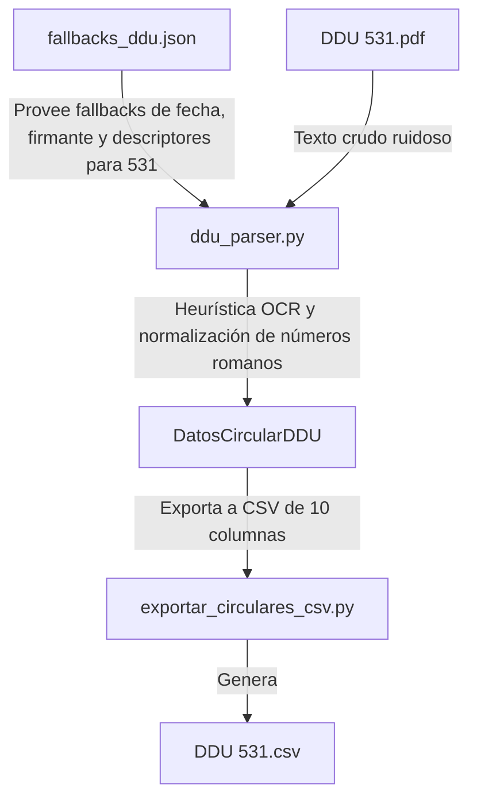

# Plan de Implementación: Corrección de Extracción de DDU 531

> **Para trabajadores agenticos:** REQUIRED SUB-SKILL: Use superpowers:subagent-driven-development to implement this plan task-by-task. Steps use checkbox (`- [ ]`) syntax for tracking.

**Goal:** Solucionar los errores de extracción de datos detectados para la circular DDU 531 en el parser, refinando la detección OCR de metadatos, normalizando los números romanos leídos incorrectamente en el cuerpo del documento, y asegurando el correcto corte e identificación de firmas y la distribución.

**Architecture:**
El parser base (`DDUParser`) se modificará para robustecer la limpieza OCR y la heurística de metadatos/secciones romanas, apoyándose también en definiciones precisas en el JSON de fallbacks.


**Tech Stack:** Python 3, PyPDF, Regex.

## Global Constraints
* Cumplir estrictamente con el estándar de tipado strict de Python en todas las firmas.
* Redactar commits exclusivamente en español de acuerdo con `GEMINI.md`.

---

## Tareas de Implementación

### Tarea 1: Corregir Fallbacks de DDU 531 en Configuración
Alinear la configuración de fallbacks estáticos para la circular 531.

**Files:**
*   Modify: [`scripts/config/fallbacks_ddu.json`](file:///C:/Users/Pedro%20Reus%20Chereau/Documents/Proyecto-Biblioteca-Normativa-Circulares/scripts/config/fallbacks_ddu.json)

- [ ] **Step 1: Modificar los metadatos de DDU 531**
  Reemplazar los campos de la sección `"531"` en el JSON de fallbacks para limpiar los antecedentes, corregir la fecha a `2026-02-17`, y proveer los descriptores, número de acto administrativo y firmante reales:
  ```diff
     "531": {
  -    "fecha": "2023-02-17",
  +    "fecha": "2026-02-17",
       "materia": "Artículos 5.1.17. y 5.1.18. de la Ordenanza General de Urbanismo y Construcciones. Modificación de proyecto. Complementa circular Ord. N° 0535 de fecha 26 de diciembre de 2016. (DDU 328)",
       "emisor": "JEFE DIVISION DE DESARROLLO URBANO",
  -    "antecedentes": "De conformidad con lo dispuesto en el artículo 4° del D.F.L. N° 458, de 1975 Ley General de Urbanismo y Construcciones (LGUC).",
  +    "antecedentes": "",
  +    "numero_ord": "088",
  +    "descriptores": "PERMISOS, APROBACIONES Y RECEPCIONES; MODIFICACION DE PROYECTOS",
  +    "firmante": "VICENTE BURGOS SALAS, JEFE DIVISIÓN DE DESARROLLO URBANO",
       "secciones": [
         {
           "titulo": "I. ANTECEDENTES",
  ```

- [ ] **Step 2: Commit parcial**
  ```powershell
  git add scripts/config/fallbacks_ddu.json
  git commit -m "refact: corregir y enriquecer fallbacks estáticos de la circular DDU 531"
  ```

---

### Tarea 2: Robustecer la Lógica del Parser Central
Actualizar el parser central para procesar variaciones ruidosas de OCR en el encabezado, cuerpo y distribución.

**Files:**
*   Modify: [`scripts/ddu_parser.py`](file:///C:/Users/Pedro%20Reus%20Chereau/Documents/Proyecto-Biblioteca-Normativa-Circulares/scripts/ddu_parser.py)

- [ ] **Step 1: Robustecer la extracción de número ORD**
  Modificar el extractor de `numero_ord` para tolerar variaciones como `ORO`, `OR0` y leer del fallback si está disponible:
  ```diff
           # 2.b Extraer numero_ord y destinatarios
           numero_ord = ""
           # Buscar el número de orden de forma genérica
  -        match_ord = re.search(r"ORD\.\s*(?:N[°oº]?\s*)?([0-9\s_l·\-]+)", raw_text_norm, re.IGNORECASE)
  +        match_ord = re.search(r"\b(?:ORD|ORO|OR0|OR)\.?\s*(?:N[°oº\?]?\s*)?([0-9\s_l·\-,]+)", raw_text_norm, re.IGNORECASE)
           if match_ord:
               ord_raw = match_ord.group(1).strip()
               ord_clean = re.sub(r"[^0-9a-zA-Z]", "", ord_raw)
  ```
  Y asegurar la lectura del fallback si no se extrae por OCR:
  ```diff
           if not numero_ord and numero == "533":
               numero_ord = "112"
  +        if not numero_ord and numero in self.fallbacks_estaticos:
  +            numero_ord = self.fallbacks_estaticos[numero].get("numero_ord", "")
  ```

- [ ] **Step 2: Asegurar descriptores y firmante de fallback**
  *   Modificar la sobreescritura de metadatos (línea 345) en `parse_pdf` para poblar descriptores y firmante desde el JSON:
  ```diff
           # Sobreescribir selectivamente metadatos de fallback conocidos para circulares específicas
           if numero in self.fallbacks_estaticos:
               fb = self.fallbacks_estaticos[numero]
               # Si es la 531 o si la fecha quedó vacía o corrupta, forzamos la de fallback
               if numero == "531" or not fecha or fecha == "2016-12-26":
                   fecha = fb["fecha"]
               # Si es la 531 o si la materia quedó vacía, forzamos la de fallback
               if numero == "531" or not materia:
                   materia = fb["materia"]
  +            # Sobreescribir descriptores y firmante si están definidos
  +            if "descriptores" in fb and not descriptores:
  +                descriptores = fb["descriptores"]
  +            if "firmante" in fb and not firmante:
  +                firmante = fb["firmante"]
  ```
  *   Y permitir firmante genérico para 2026:
  ```diff
           # 7. Extraer firmante y lista de distribución
           firmante = ""
  -        if numero == "533":
  +        if numero in ["531", "533", "537", "546"]:
               firmante = "VICENTE BURGOS SALAS, JEFE DIVISIÓN DE DESARROLLO URBANO"
  +        if numero in self.fallbacks_estaticos and "firmante" in self.fallbacks_estaticos[numero]:
  +            firmante = self.fallbacks_estaticos[numero]["firmante"]
  ```

- [ ] **Step 3: Robustecer normalización de secciones y corte de distribución**
  *   Normalizar números romanos leídos erróneamente en el bucle de líneas del cuerpo (línea 295):
  ```diff
           for line in lines:
               line_clean = line.strip()
               if not line_clean:
                   continue
  
  -            if "BUCIÓN:" in line_clean.upper() or "DISTRIBUCIÓN:" in line_clean.upper():
  +            # Corte de distribución flexible (cubre D STRIBUCI?N:, DISTRIBUCION:, etc.)
  +            if re.search(r"\b(?:D\s*S|D)?\s*STRIBUC[I\?OÓ]+N\b", line_clean, re.IGNORECASE):
  +                break
  +
  +            # Normalizar errores comunes de OCR en secciones romanas antes de parsear
  +            # ej: l. ANTECEDENTES -> I. ANTECEDENTES
  +            line_clean = re.sub(r"^l\.\s+([A-ZÁÉÍÓÚÑ\s]{3,})$", r"I. \1", line_clean)
  +            # ej: 11. NORMATIVA APLICABLE -> II. NORMATIVA APLICABLE
  +            line_clean = re.sub(r"^11\.\s+([A-ZÁÉÍÓÚÑ\s]{3,})$", r"II. \1", line_clean)
  ```
  *   Robustecer la regex que captura la lista de distribución (línea 364):
  ```diff
           lista_distribucion_str = ""
  -        match_dist = re.search(r"(?:DISTRIBUCI[OÓ]N|BUCI[OÓ]N)\s*:?\s*(.*)", raw_text_norm, re.IGNORECASE | re.DOTALL)
  +        match_dist = re.search(r"(?:DISTRIBUCI[OÓ\?I\s]+N|BUCI[OÓ\?I\s]+N)\s*:?\s*(.*)", raw_text_norm, re.IGNORECASE | re.DOTALL)
  ```

- [ ] **Step 4: Commit parcial**
  ```powershell
  git add scripts/ddu_parser.py
  git commit -m "refact: robustecer heurística OCR para ORD, secciones romanas y distribución en el parser"
  ```

---

### Tarea 3: Regenerar y Validar CSVs
Correr el exportador y comprobar la correctitud física y semántica de la salida de la DDU 531.

- [ ] **Step 1: Ejecutar el script exportador**
  Correr en la consola:
  ```powershell
  python scripts/exportar_circulares_csv.py
  ```

- [ ] **Step 2: Verificar la salida de DDU 531**
  Comprobar que el archivo `bcn - circulares - csv/DDU 531.csv`:
  *   Fila 3 (Acto Administrativo): valor_extraido sea `088`.
  *   Fila 4 (Antecedentes): valor_extraido esté vacío `""`.
  *   Fila 6 (Descriptores): valor_extraido sea `PERMISOS, APROBACIONES Y RECEPCIONES; MODIFICACION DE PROYECTOS`.
  *   Fila 7 (Fecha y Lugar): valor_extraido sea `2026-02-17`.
  *   Cuerpo (Secciones romanas): contenga `I. ANTECEDENTES`, `II. NORMATIVA APLICABLE` y `III. INSTRUCCION COMPLEMENTARIA...` con sus numerales correspondientes anidados.
  *   Firma y Distribución: contenga el firmante correcto y la lista limpia de distribución.

---

### Tarea 4: Ejecución de Tests
Validar la suite completa del proyecto.

- [ ] **Step 1: Correr pytest**
  Correr: `python -m pytest`
  Resultado esperado: `5 passed`.
