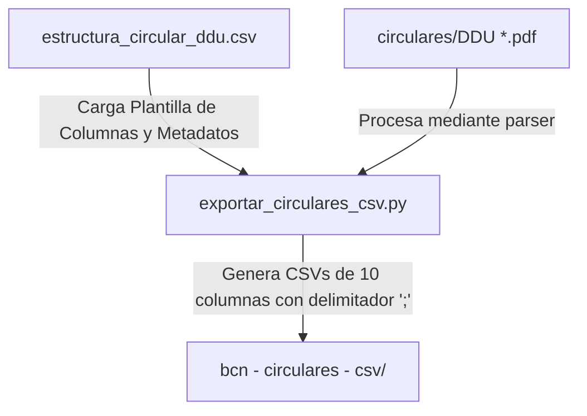

# Plan de Implementación: Exportación de Circulares a CSV Estructurado

> **Para trabajadores agenticos:** SUB-SKILL REQUERIDO: Usar `superpowers:subagent-driven-development` para implementar este plan tarea por tarea. Los pasos usan la sintaxis de casillas de verificación (`- [ ]`) para el seguimiento.

**Objetivo:** Desarrollar un script ejecutable que procese por lotes las circulares DDU 531, 533, 537 y 546 mediante el parser existente y guarde sus datos estructurados en archivos CSV independientes en el directorio `bcn - circulares - csv/`, utilizando punto y coma (`;`) como delimitador y heredando todos los metadatos documentales de la maqueta base.

**Arquitectura:**


---

## Tareas de Implementación

### Tarea 1: Aislamiento de Archivos de Salida en Git
Asegurar que los archivos CSV generados localmente no contaminen el repositorio.

**Archivos:**
*   Modificar: [`.gitignore`](file:///C:/Users/Pedro%20Reus%20Chereau/Documents/Proyecto-Biblioteca-Normativa-Circulares/.gitignore)

- [ ] **Paso 1: Agregar exclusión del directorio de salida**
  Editar `.gitignore` para agregar la línea:
  ```text
  /bcn - circulares - csv/
  ```

---

### Tarea 2: Crear el Script Exportador
Crear el archivo del script de automatización y poblarlo con la lógica de procesamiento.

**Archivos:**
*   Crear: [`scripts/exportar_circulares_csv.py`](file:///C:/Users/Pedro%20Reus%20Chereau/Documents/Proyecto-Biblioteca-Normativa-Circulares/scripts/exportar_circulares_csv.py)

- [ ] **Paso 1: Inicialización y carga de plantilla**
  *   Crear la carpeta `/bcn - circulares - csv/` si no existe.
  *   Escribir rutinas para leer la plantilla base [`bcn - documentación/estructura_circular_ddu.csv`](file:///C:/Users/Pedro%20Reus%20Chereau/Documents/Proyecto-Biblioteca-Normativa-Circulares/bcn%20-%20documentación/estructura_circular_ddu.csv) (delimitador `,`) y guardar las definiciones de fila en memoria.

- [ ] **Paso 2: Implementar algoritmo de mapeo secuencial**
  Crear una función `exportar_circular_a_csv(numero_ddu: str)` que:
  *   Instancie `DDUParser` con el PDF correspondiente.
  *   Recupere el diccionario `DatosCircularDDU` retornado.
  *   Inicialice el CSV de salida (delimitador `;` y codificación UTF-8 con BOM `utf-8-sig` para compatibilidad directa de Excel).
  *   Escriba la cabecera del CSV agregando la columna `valor_extraido`.
  *   Escribir campos únicos (encabezado y cierre) mapeando las definiciones y completando `valor_extraido`.
  *   Procesar dinámicamente el cuerpo (`secciones` y sus `parrafos`):
      *   Agregar fila `seccion_romana` si el título contiene número romano.
      *   Para cada párrafo, agregar fila `numeral_arabigo`.
      *   Si hay subtítulos o listas en el párrafo, extraerlos mediante regex e insertar filas correspondientes de `subtitulo_numeral` y `lista_multinivel` inmediatamente después.
      *   Agregar filas `referencia_cruzada` y `tabla_imagen` al final del cuerpo.

- [ ] **Paso 3: Bucle por lotes**
  Escribir el bloque ejecutable `if __name__ == "__main__":` que procese las circulares 531, 533, 537 y 546 reportando el éxito o errores por consola.

---

### Tarea 3: Ejecución y Validación
Validar el funcionamiento del script y el formato de los CSVs generados.

**Archivos:**
*   Validar: [`bcn - circulares - csv/`](file:///C:/Users/Pedro%20Reus%20Chereau/Documents/Proyecto-Biblioteca-Normativa-Circulares/bcn%20-%20circulares%20-%20csv/)

- [ ] **Paso 1: Ejecutar el script exportador**
  Correr en la consola:
  ```powershell
  python scripts/exportar_circulares_csv.py
  ```
  Validar que termine sin excepciones e imprima el reporte por pantalla.

- [ ] **Paso 2: Comprobar existencia y consistencia de los CSVs**
  *   Verificar que la carpeta `bcn - circulares - csv/` contenga exactamente 4 archivos CSV (`DDU 531.csv`, `DDU 533.csv`, `DDU 537.csv`, `DDU 546.csv`).
  *   Inspeccionar que el delimitador utilizado sea `;` y posea exactamente 10 columnas con la columna de valor poblada.

---

### Tarea 4: Validación y Pruebas
Garantizar la estabilidad general de la suite de pruebas del proyecto.

- [ ] **Paso 1: Correr la suite de pytest**
  Correr: `python -m pytest`
  Resultado esperado: `5 passed`.

---

### Tarea 5: Confirmación en Git y Changelog
Confirmar los cambios del script en el control de versiones y documentar en CHANGELOG.md.

**Archivos:**
*   Modificar: [`CHANGELOG.md`](file:///C:/Users/Pedro%20Reus%20Chereau/Documents/Proyecto-Biblioteca-Normativa-Circulares/CHANGELOG.md)

- [ ] **Paso 1: Registrar en CHANGELOG.md**
  Añadir los detalles del exportador en la versión `0.4.1` (o en la actual).

- [ ] **Paso 2: Confirmar en Git**
  ```powershell
  git add .gitignore scripts/exportar_circulares_csv.py CHANGELOG.md
  git commit -m "feat: implementar script exportador por lotes de circulares a CSV estructurado individual"
  ```
