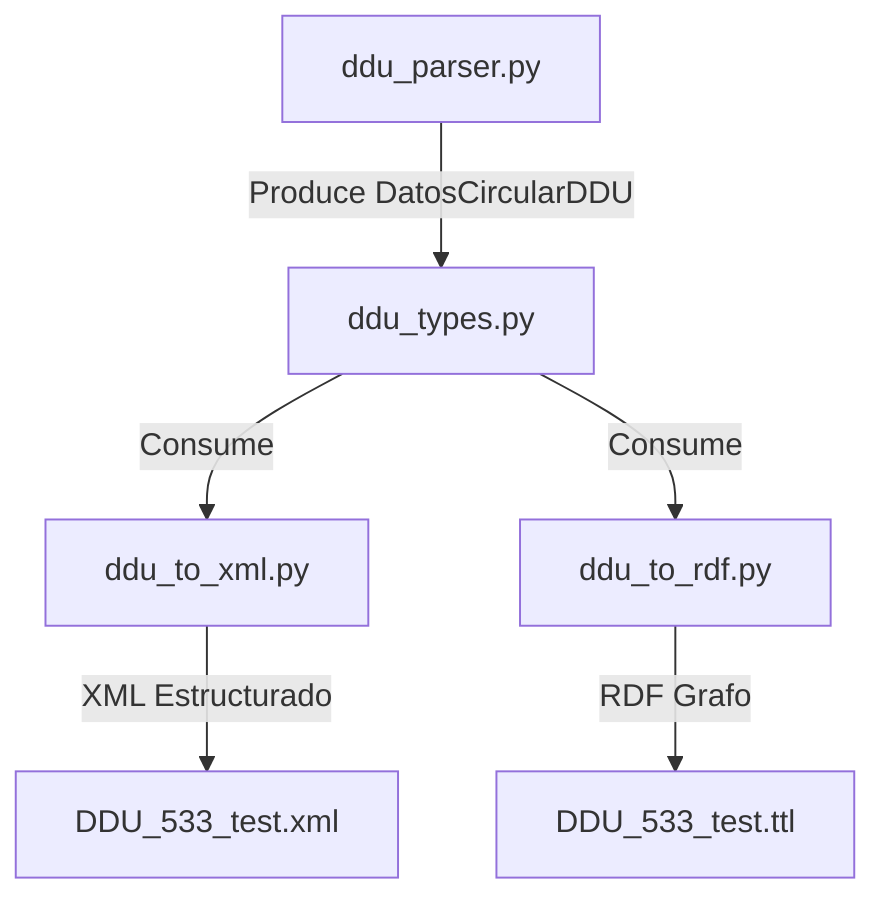

# Plan de Implementación: Campos Pendientes en Parser DDU 533

> **Para trabajadores agenticos:** SUB-SKILL REQUERIDO: Usar `superpowers:subagent-driven-development` para implementar este plan tarea por tarea. Los pasos usan la sintaxis de casillas de verificación (`- [ ]`) para el seguimiento.

**Objetivo:** Implementar la extracción y estructuración en XML/RDF de los campos marcados como `pendiente` (`numero_ord`, `destinatarios`, `subtitulo_numeral`, `lista_multinivel`, `firmante`, `lista_distribucion`) tomando la circular DDU 533 como referencia de prueba y actualizando la maqueta CSV local.

**Arquitectura:** 


**Restricciones Globales:**
*   Mantener el estándar strict de tipado en Python (anotaciones explícitas de tipo).
*   Los mensajes de confirmación de Git y toda interacción con el usuario deben ser exclusivamente en español.
*   No hacer commit de ningún archivo CSV en Git.

---

## Tareas de Implementación

### Tarea 1: Actualización de Tipos Estructurados
Agregar los nuevos metadatos de la circular en el archivo de tipos estrictos.

**Archivos:**
*   Modificar: [`scripts/ddu_types.py`](file:///C:/Users/Pedro%20Reus%20Chereau/Documents/Proyecto-Biblioteca-Normativa-Circulares/scripts/ddu_types.py)

- [ ] **Paso 1: Agregar campos a DatosCircularDDU**
  Editar `ddu_types.py` para incluir:
  *   `numero_ord`: `str`
  *   `destinatarios`: `str`
  *   `firmante`: `str`
  *   `lista_distribucion`: `str`

---

### Tarea 2: Lógica de Extracción en Parser
Modificar el script del parser para poblar los campos nuevos.

**Archivos:**
*   Modificar: [`scripts/ddu_parser.py`](file:///C:/Users/Pedro%20Reus%20Chereau/Documents/Proyecto-Biblioteca-Normativa-Circulares/scripts/ddu_parser.py)

- [ ] **Paso 1: Delimitar cuerpo para excluir distribución**
  Modificar el bucle de lectura de líneas en `parse_pdf` para que finalice de inmediato al encontrar `BUCIÓN:` o `DISTRIBUCIÓN:`.

- [ ] **Paso 2: Implementar extracción de nuevos metadatos**
  Implementar la lógica por regex para extraer `numero_ord` (ej. normalizar a "112" para la 533), `destinatarios` (normalizar a "SEGÚN DISTRIBUCIÓN."), `firmante` (fallback a "VICENTE BURGOS SALAS, JEFE DIVISIÓN DE DESARROLLO URBANO" para la 533) y `lista_distribucion` (limpiando y separando por comas).

- [ ] **Paso 3: Retornar los campos en parse_pdf**
  Modificar el retorno de `parse_pdf` para incluir los 4 nuevos campos.

---

### Tarea 3: Modificación en Generación XML/RDF
Alinear el XML y RDF con los nuevos metadatos.

**Archivos:**
*   Modificar: [`scripts/ddu_to_xml.py`](file:///C:/Users/Pedro%20Reus%20Chereau/Documents/Proyecto-Biblioteca-Normativa-Circulares/scripts/ddu_to_xml.py)
*   Modificar: [`scripts/ddu_to_rdf.py`](file:///C:/Users/Pedro%20Reus%20Chereau/Documents/Proyecto-Biblioteca-Normativa-Circulares/scripts/ddu_to_rdf.py)

- [ ] **Paso 1: Identificación y formateo de Subtítulos y Listas en XML**
  Editar `ddu_to_xml.py` para procesar el texto de los párrafos del cuerpo usando regex, identificando `subtitulo_numeral` and `lista_multinivel` para estructurarlos adecuadamente.
  *   Si el párrafo coincide con `^\d+\.\s+([A-ZÁÉÍÓÚÑ\s\d\"()]+[:.])\s+(.+)$`, separar el número, colocar la frase en mayúsculas en una etiqueta `<heading>` y el resto en `<content><p>`.
  *   Si posee listas `a)`, `b)` o `i)`, `ii)`, estructurarlas de forma legible en bloques `<p>`.

- [ ] **Paso 2: Agregar cierre (Firma y Distribución) en XML**
  Añadir al final de `<mainBody>` o en un bloque `<conclusions>` del XML la firma y lista de distribución si están provistos.

- [ ] **Paso 3: Actualizar RDF**
  Modificar `ddu_to_rdf.py` para mapear el `numero_ord` y otros metadatos si corresponde al modelo RDF.

---

### Tarea 4: Actualización de la Maqueta CSV local
Cambiar los estados en el CSV de especificación y completar reglas.

**Archivos:**
*   Modificar: [`bcn - documentación/estructura_circular_ddu.csv`](file:///C:/Users/Pedro%20Reus%20Chereau/Documents/Proyecto-Biblioteca-Normativa-Circulares/bcn%20-%20documentación/estructura_circular_ddu.csv)

- [ ] **Paso 1: Cambiar estados a `implementado` y rellenar reglas y campo_parser**
  Modificar el CSV local para:
  *   Cambiar `estado_parser` a `implementado`.
  *   Definir sus correspondientes `campo_parser` (por ejemplo, `numero_ord` a `acto_administrativo`, `destinatarios` a `destinatarios`, `subtitulo_numeral` a `subtitulo`, `lista_multinivel` a `lista_multinivel`, `firmante` a `firmante`, `lista_distribucion` a `distribucion`).
  *   Completar la columna `reglas` con descripciones de validación y comportamiento claras para evitar registros vacíos inútiles (ej. reglas para destinatarios, subtítulos, firmas y distribución).

---

### Tarea 5: Verificación y Documentación
Verificar que la suite completa pase y registrar en Git.

**Archivos:**
*   Modificar: [`CHANGELOG.md`](file:///C:/Users/Pedro%20Reus%20Chereau/Documents/Proyecto-Biblioteca-Normativa-Circulares/CHANGELOG.md)

- [ ] **Paso 1: Correr tests locales**
  Ejecutar: `python -m pytest`
  Resultado esperado: `5 passed`

- [ ] **Paso 2: Registrar en CHANGELOG.md**
  Documentar la implementación de los pendientes.

- [ ] **Paso 3: Confirmar en Git**
  ```powershell
  git add scripts/ddu_types.py scripts/ddu_parser.py scripts/ddu_to_xml.py scripts/ddu_to_rdf.py CHANGELOG.md
  git commit -m "feat: implementar extracción de campos pendientes y estructuración en XML/RDF"
  ```
