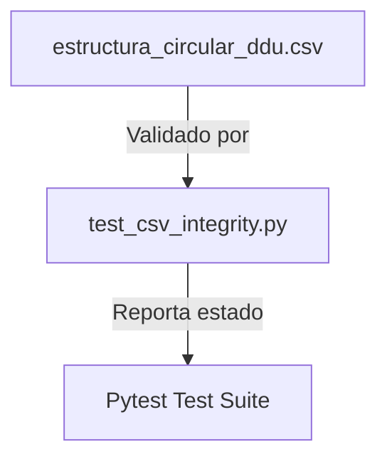

# Plan de Implementación: Refactorización de Estructura Circular DDU (Maqueta DDU 533)

> **Para trabajadores agenticos:** SUB-SKILL REQUERIDO: Usar `superpowers:subagent-driven-development` para implementar este plan tarea por tarea. Los pasos usan la sintaxis de casillas de verificación (`- [ ]`) para el seguimiento.

**Objetivo:** Actualizar el archivo de especificación tabular `estructura_circular_ddu.csv` para convertirlo en una maqueta exacta de la circular DDU 533, definiendo la nueva fila de subtítulos y configurando las filas no aplicables a esta circular.

**Arquitectura:** 
El archivo [`bcn - documentación/estructura_circular_ddu.csv`](file:///C:/Users/Pedro%20Reus%20Chereau/Documents/Proyecto-Biblioteca-Normativa-Circulares/bcn%20-%20documentación/estructura_circular_ddu.csv) es una especificación estática en formato CSV con 12 columnas. El script de prueba [`test/test_csv_integrity.py`](file:///C:/Users/Pedro%20Reus%20Chereau/Documents/Proyecto-Biblioteca-Normativa-Circulares/test/test_csv_integrity.py) se encarga de analizar sintáctica y semánticamente este archivo para validar que todas las filas tengan la alineación de columnas correcta y que los campos obligatorios no estén vacíos.

**Diagrama de Arquitectura:**



**Pila Tecnológica:**
*   Python 3.11+
*   Pytest para la ejecución de la suite de pruebas
*   Formato CSV (codificación UTF-8, delimitado por comas)

## Restricciones Globales
*   Mantener exactamente las 12 columnas del archivo CSV en cada fila.
*   Los campos críticos (`bloque`, `campo`, `tipo_dato`, `obligatorio`, `orden`, `zona`) no pueden estar vacíos en ninguna fila activa.
*   Toda la interacción y mensajes de confirmación de Git deben ser estrictamente en español.
*   Codificar el archivo en UTF-8 con saltos de línea estándar (LF o CRLF).

---

## Tareas de Implementación

### Tarea 1: Refactorización de Campos Existentes en el CSV
Modificar los campos del encabezado, emisor y elementos no aplicables en el archivo CSV para reflejar la maqueta DDU 533.

**Archivos:**
*   Modificar: [`bcn - documentación/estructura_circular_ddu.csv`](file:///C:/Users/Pedro%20Reus%20Chereau/Documents/Proyecto-Biblioteca-Normativa-Circulares/bcn%20-%20documentación/estructura_circular_ddu.csv)

**Interfaces:**
*   Consume: Especificación actual de `estructura_circular_ddu.csv`.
*   Produce: Archivo CSV editado con encabezados y elementos no aplicables modificados.

- [ ] **Paso 1: Realizar los cambios en campos de encabezado y no aplicables**
  Modificar el archivo `estructura_circular_ddu.csv` reemplazando el contenido de las filas 2, 3, 4, 9, 10, 11, 13 y 14.
  Los reemplazos específicos son:
  *   Fila 2 (Encabezado): cambiar `patron_regex` a `533` y `ejemplo` a `533`.
  *   Fila 3 (Acto Administrativo): cambiar `patron_regex` a `112` y `ejemplo` a `112`.
  *   Fila 4 (Antecedentes): dado que la circular 533 tiene antecedentes (se listan al inicio: 1) DS 33, 2) Art 1.4.17 OGUC, 3) Art 120 LGUC), mantenemos esta fila tal cual.
  *   Fila 9 (Emisión): cambiar `patron_regex` a `JEFE DIVISION DE DESARROLLO URBANO.` y `ejemplo` a `JEFE DIVISION DE DESARROLLO URBANO.`.
  *   Fila 10 (seccion_romana): cambiar `patron_regex` a vacío `""`, `ejemplo` a vacío `""`, `estado_parser` a `no_aplica_ddu_533` y `reglas` a `No aplicable a la circular maqueta DDU 533`.
  *   Fila 11 (numeral_arabigo): cambiar `ejemplo` a `"1. De conformidad con lo previsto en el artículo 4° de la Ley General de Urbanismo y Construcciones (LGUC), corresponde a esta División interpretar las disposiciones de la dicha Ley y su Ordenanza General mediante circulares que quedarán a disposición de cualquier interesado, y en atención a diversas consultas recibidas relativas a la extensión extraordinaria de vigencia de permisos de construcción establecida por el D.S. Nº33 (V. y U.) de 2024 (en adelante DS 33), se imparten las siguientes instrucciones para uniformar su aplicación."`.
  *   Fila 13 (referencia_cruzada): cambiar `patron_regex` a vacío `""`, `ejemplo` a vacío `""`, `estado_parser` a `no_aplica_ddu_533` y `reglas` a `No aplicable a la circular maqueta DDU 533`.
  *   Fila 14 (tabla_imagen): cambiar `patron_regex` a vacío `""`, `ejemplo` a vacío `""`, `estado_parser` a `no_aplica_ddu_533` y `reglas` a `No aplicable a la circular maqueta DDU 533`.

- [ ] **Paso 2: Validar formato estructural del CSV modificado**
  Ejecutar el test de integridad para comprobar que las filas editadas siguen respetando la estructura columnar:
  *   Ejecutar: `pytest test/test_csv_integrity.py -v`
  *   Resultado esperado: `PASO`

- [ ] **Paso 3: Realizar confirmación parcial en Git**
  Confirmar los cambios parciales:
  ```powershell
  git add "bcn - documentación/estructura_circular_ddu.csv"
  git commit -m "refact: actualizar campos existentes y no aplicables para maqueta DDU 533"
  ```

---

### Tarea 2: Inserción del Campo 'subtitulo_numeral' y Ajuste de Órdenes
Agregar una fila nueva para representar los subtítulos de los numerales y ajustar el orden correlativo de las filas posteriores.

**Archivos:**
*   Modificar: [`bcn - documentación/estructura_circular_ddu.csv`](file:///C:/Users/Pedro%20Reus%20Chereau/Documents/Proyecto-Biblioteca-Normativa-Circulares/bcn%20-%20documentación/estructura_circular_ddu.csv)

**Interfaces:**
*   Consume: Archivo CSV modificado de la Tarea 1.
*   Produce: Archivo CSV con la nueva fila insertada en el orden correcto y con órdenes actualizados.

- [ ] **Paso 1: Agregar fila para subtitulo_numeral y ajustar órdenes**
  Insertar la siguiente línea en el CSV inmediatamente después de la fila `numeral_arabigo`:
  `Cuerpo,subtitulo_numeral,estructura,no,"^([A-ZÁÉÍÓÚÑ\s\d\"()]+[:.])",11,cuerpo,,pendiente,Subtítulo en mayúsculas dentro del numeral,Subtítulo de sección dentro del numeral arábigo,MARCO NORMATIVO: DS 33.`
  
  Ajustar las siguientes líneas del CSV para actualizar su columna de `orden`:
  *   Fila `referencia_cruzada` -> cambiar orden de `12` a `12` (se mantiene).
  *   Fila `tabla_imagen` -> cambiar orden de `13` a `13` (se mantiene).
  *   Fila `Firma` -> cambiar orden de `14` a `15`.
  *   Fila `Distribución` -> cambiar orden de `15` a `16`.

- [ ] **Paso 2: Validar integridad del archivo final**
  Ejecutar el test de integridad para certificar que el archivo CSV es 100% válido y cumple las reglas de formato:
  *   Ejecutar: `pytest test/test_csv_integrity.py -v`
  *   Resultado esperado: `PASO`

- [ ] **Paso 3: Ejecutar la suite de pruebas completa**
  Correr toda la suite de pruebas del proyecto para asegurar que no hay regresiones semánticas ni estructurales:
  *   Ejecutar: `pytest`
  *   Resultado esperado: 100% exitoso (todos los tests pasan)

- [ ] **Paso 4: Confirmar los cambios en Git**
  ```powershell
  git add "bcn - documentación/estructura_circular_ddu.csv"
  git commit -m "feat: agregar campo subtitulo_numeral y reajustar orden correlativo en CSV de estructura"
  ```

---

### Tarea 3: Documentación en CHANGELOG
Registrar las mejoras de la maqueta y la refactorización realizadas en el archivo `CHANGELOG.md` del repositorio.

**Archivos:**
*   Modificar: [`CHANGELOG.md`](file:///C:/Users/Pedro%20Reus%20Chereau/Documents/Proyecto-Biblioteca-Normativa-Circulares/CHANGELOG.md)

**Interfaces:**
*   Consume: Historial del CHANGELOG.
*   Produce: Archivo CHANGELOG con el registro de la versión/cambios del día de hoy.

- [ ] **Paso 1: Agregar los cambios al archivo CHANGELOG**
  Editar [`CHANGELOG.md`](file:///C:/Users/Pedro%20Reus%20Chereau/Documents/Proyecto-Biblioteca-Normativa-Circulares/CHANGELOG.md) para agregar una sección de los cambios realizados en la fecha de hoy, detallando los puntos de la refactorización (maqueta DDU 533, exclusión de seccion_romana/referencia/tabla_imagen, adición de subtitulo_numeral).

- [ ] **Paso 2: Confirmar en Git**
  ```powershell
  git add CHANGELOG.md
  git commit -m "doc: documentar refactorización de maqueta estructural en CHANGELOG"
  ```
