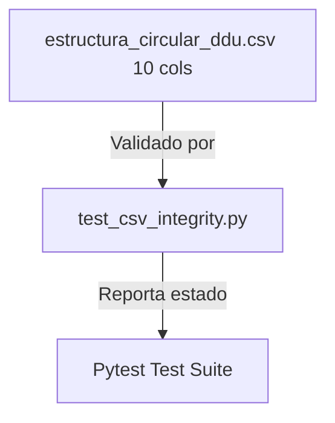

# Plan de Implementación: Simplificación de Columnas en CSV de Estructura DDU

> **Para trabajadores agenticos:** SUB-SKILL REQUERIDO: Usar `superpowers:subagent-driven-development` para implementar este plan tarea por tarea. Los pasos usan la sintaxis de casillas de verificación (`- [ ]`) para el seguimiento.

**Objetivo:** Remover las columnas `tipo_dato` y `patron_regex` del archivo CSV de especificación de estructura local y actualizar la validación del test de integridad correspondiente para esperar 10 columnas.

**Arquitectura:** 
El archivo [`bcn - documentación/estructura_circular_ddu.csv`](file:///C:/Users/Pedro%20Reus%20Chereau/Documents/Proyecto-Biblioteca-Normativa-Circulares/bcn%20-%20documentación/estructura_circular_ddu.csv) es una especificación tabular que pasa de tener 12 columnas a 10 columnas. El test de integridad de datos [`test/test_csv_integrity.py`](file:///C:/Users/Pedro%20Reus%20Chereau/Documents/Proyecto-Biblioteca-Normativa-Circulares/test/test_csv_integrity.py) se adapta para validar el nuevo formato y alineamiento de las 10 columnas y omitir la validación de campo requerido para `tipo_dato`.

**Diagrama de Arquitectura:**



**Pila Tecnológica:**
*   Python 3.11+
*   Pytest para testing
*   CSV (Codificación UTF-8, delimitado por comas)

## Restricciones Globales
*   Mantener exactamente 10 columnas en cada fila del archivo CSV.
*   Los campos críticos (`bloque`, `campo`, `obligatorio`, `orden`, `zona`) no pueden estar vacíos en ninguna fila activa.
*   Toda la interacción y mensajes de confirmación de Git deben ser exclusivamente en español.
*   No versionar ni hacer commit de ningún archivo CSV en Git.

---

## Tareas de Implementación

### Tarea 1: Simplificación del CSV local
Editar el archivo `estructura_circular_ddu.csv` para remover las columnas `tipo_dato` y `patron_regex`.

**Archivos:**
*   Modificar: [`bcn - documentación/estructura_circular_ddu.csv`](file:///C:/Users/Pedro%20Reus%20Chereau/Documents/Proyecto-Biblioteca-Normativa-Circulares/bcn%20-%20documentación/estructura_circular_ddu.csv)

**Interfaces:**
*   Consume: Archivo CSV actual con 12 columnas.
*   Produce: Archivo CSV simplificado con exactamente 10 columnas por fila.

- [ ] **Paso 1: Modificar cabecera y registros de datos**
  Modificar el archivo `estructura_circular_ddu.csv` para que su contenido sea:
  ```csv
  bloque,campo,obligatorio,orden,zona,campo_parser,estado_parser,reglas,descripcion,ejemplo
  Encabezado,numero_ddu,si,1,encabezado,numero,implementado,Secuencial y permite singularizar la circular,Número identificador de la circular DDU,533
  Acto Administrativo,numero_ord,si,2,encabezado,,pendiente,Número de acto administrativo diferente al número DDU,Número del acto de emisión de la DDU,112
  Antecedentes,antecedentes,no,3,encabezado,antecedentes,implementado,Campo implícito del oficio chileno,Documentos o definiciones en los que se basó para construir la circular,"1) Decreto Supremo Nº33 (V. y U.) de 2024, que agregó un artículo transitorio a la OGUC, en materia de caducidad de permisos de construcción. 2) Artículo 1.4.17. de la OGUC. 3) Artículo 120 de la LGUC."
  Materia,materia,si,4,encabezado,materia,implementado,,Descripción del tema abordado,"Prórroga extraordinaria por dieciocho (18) meses adicionales de permisos de construcción vigentes y sin inicio de obras a la fecha de entrada en vigencia del D.S. N°33 (V. y U.) de 2024. Instruye criterios para su cómputo y aplicación uniforme."
  Descriptores,descriptores,no,5,encabezado,,no_relevante,No relevante para la aplicación de la circular,Expresiones y vocablos asignados,"PERMISOS, VIGENCIA, RECEPCIONES."
  Fecha y Lugar,fecha_emision,si,6,encabezado,fecha,implementado,Permite singularizar junto con el número DDU,Fecha de emisión de la circular,"Santiago, 27 FEB 2026"
  Destinatarios,destinatarios,si,7,encabezado,,pendiente,,A quién va dirigida formalmente la circular,"SEGÚN DISTRIBUCIÓN."
  Emisión,emisor,si,8,encabezado,emisor,implementado,,Identifica al emisor de la circular DDU,JEFE DIVISION DE DESARROLLO URBANO.
  Cuerpo,seccion_romana,no,9,cuerpo,secciones,no_aplica_ddu_533,No aplicable a la circular maqueta DDU 533,Sección principal numerada con romano,""
  Cuerpo,numeral_arabigo,si,10,cuerpo,secciones,implementado,Primer punto es resumen del contenido,Numeral o punto del cuerpo de la circular,"1. De conformidad con lo previsto en el artículo 4° de la Ley General de Urbanismo y Construcciones (LGUC), corresponde a esta División interpretar las disposiciones de la dicha Ley y su Ordenanza General mediante circulares que quedarán a disposición de cualquier interesado, y en atención a diversas consultas recibidas relativas a la extensión extraordinaria de vigencia de permisos de construcción establecida por el D.S. Nº33 (V. y U.) de 2024 (en adelante DS 33), se imparten las siguientes instrucciones para uniformar su aplicación."
  Cuerpo,subtitulo_numeral,no,11,cuerpo,,pendiente,Subtítulo en mayúsculas dentro del numeral,Subtítulo de sección dentro del numeral arábigo,MARCO NORMATIVO: DS 33.
  Cuerpo,lista_multinivel,no,12,cuerpo,,pendiente,Listas anidadas de números o letras,Listas multinivel del cuerpo,"a) Que se encuentren vigentes a la fecha de entrada en vigencia del DS 33, esto es, a la fecha de su publicación en el Diario Oficial; y,"
  Cuerpo,referencia_cruzada,no,13,cuerpo,,no_aplica_ddu_533,No aplicable a la circular maqueta DDU 533,Referencias a otras circulares,""
  Cuerpo,tabla_imagen,no,14,cuerpo,,no_aplica_ddu_533,No aplicable a la circular maqueta DDU 533,Elementos visuales del cuerpo,""
  Firma,firmante,si,15,cierre,,pendiente,Jefe de división del periodo de emisión,Firma del jefe de división respectivo,"VICENTE BURGOS SALAS, JEFE DIVISIÓN DE DESARROLLO URBANO"
  Distribución,lista_distribucion,si,16,cierre,,pendiente,,Lista de personas que reciben copia de la circular,"1. Sr. Ministro de Vivienda y Urbanismo, 2. Sra. Subsecretaria de Vivienda y Urbanismo, 3. Sra. Contralora General de la República..."
  ```

- [ ] **Paso 2: Guardar los cambios**
  Guardar la modificación en el archivo local de la ruta principal.

---

### Tarea 2: Actualización de la Suite de Pruebas
Modificar el script `test/test_csv_integrity.py` para reflejar el nuevo formato y columnas de la especificación de estructura.

**Archivos:**
*   Modificar: [`test/test_csv_integrity.py`](file:///C:/Users/Pedro%20Reus%20Chereau/Documents/Proyecto-Biblioteca-Normativa-Circulares/test/test_csv_integrity.py)

**Interfaces:**
*   Consume: Archivo CSV de 10 columnas modificado en la Tarea 1.
*   Produce: Suite de pruebas modificada y verificada de manera local.

- [ ] **Paso 1: Modificar `test_csv_integrity.py`**
  Modificar el archivo `test_csv_integrity.py` aplicando los siguientes cambios de aserciones:
  *   Modificar la llamada a validar_csv para esperar 10 columnas:
      ```diff
      -    success_est = validar_csv(csv_estructura, 12)
      +    success_est = validar_csv(csv_estructura, 10)
      ```
  *   Remover `"tipo_dato"` de la validación de no vacíos:
      ```diff
      -                    for col in ["bloque", "campo", "tipo_dato", "obligatorio", "orden", "zona"]:
      +                    for col in ["bloque", "campo", "obligatorio", "orden", "zona"]:
      ```

- [ ] **Paso 2: Ejecutar los tests locales**
  Correr la suite de pruebas del proyecto para certificar que todo pasa exitosamente:
  *   Ejecutar: `python -m pytest`
  *   Resultado esperado: `5 passed`

- [ ] **Paso 3: Confirmar cambios del test en Git**
  ```powershell
  git add test/test_csv_integrity.py
  git commit -m "test: actualizar validaciones del test de integridad para CSV de estructura de 10 columnas"
  ```

---

### Tarea 3: Documentación en CHANGELOG
Registrar el cambio de la simplificación en `CHANGELOG.md`.

**Archivos:**
*   Modificar: [`CHANGELOG.md`](file:///C:/Users/Pedro%20Reus%20Chereau/Documents/Proyecto-Biblioteca-Normativa-Circulares/CHANGELOG.md)

**Interfaces:**
*   Consume: Historial del CHANGELOG.
*   Produce: Historial actualizado.

- [ ] **Paso 1: Agregar descripción de cambios al CHANGELOG**
  Añadir un punto en el CHANGELOG bajo la sección `## [0.3.0] - 2026-07-21` -> `Refactored` -> `Refactorización de la Estructura de Circular DDU (Maqueta DDU 533)`:
  *   "Simplificación de las columnas del CSV de estructura a 10 columnas, removiendo `tipo_dato` y `patron_regex` de la especificación documental y adaptando el test de integridad correspondiente."

- [ ] **Paso 2: Confirmar en Git**
  ```powershell
  git add CHANGELOG.md
  git commit -m "doc: registrar simplificación de columnas del CSV estructural en CHANGELOG"
  ```
